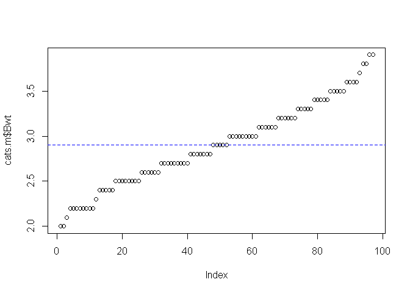

T-검정
================

# Prerequisite

``` r
rm(list=ls())
# getwd()
# setwd("./R") # if necessary

viewSamples <- function(x,n) {
  x[sort(sample(1:nrow(x), n)),]
}
```

# T-검정

## 일표본 T-검정 (One Sample T-Test)

`일표본 T-검정`은 단일모집단에서 관심이 있는 **연속형 변수**의 평균값을 특정 기준값과 비교하고자 할 때 사용하는
검정방법이다.

``` r
# 정규성 검토
# shapiro.test(data)
# 귀무가설: 데이터가 정규분포를 따른다
# 정규분포를 따를 경우 t.test(), 
# 정규분포를 따르지 않을 경우 wilcox.test()

library(MASS)
shapiro.test(cats$Bwt)
```

    ## 
    ##  Shapiro-Wilk normality test
    ## 
    ## data:  cats$Bwt
    ## W = 0.95188, p-value = 6.731e-05

p-value = 6.731e-05 값이 유의수준 0.05보다 작아 귀무가설을 기각한다. 따라서 고양이의 몸무게는 정규분포를
따른다고 할 수 없다.

``` r
# 정규부포를 따르지 않으므로 wilcox.test() 수행
wilcox.test(cats$Bwt, mu  = 2.6, alternative = "two.sided")
```

    ## 
    ##  Wilcoxon signed rank test with continuity correction
    ## 
    ## data:  cats$Bwt
    ## V = 5607, p-value = 0.02532
    ## alternative hypothesis: true location is not equal to 2.6

p-value = 0.02532 값이 유의수준 0.05보다 작아 귀무가설을 귀각한다. 따라서 고양이의 평균 몸무게는 2.6이라고
할 수 없다.

``` r
# 수컷 고양이의 몸무게로 일표본 T-검정
cats.m <- subset(cats, cats$Sex == "M")
shapiro.test(cats.m$Bwt)
```

    ## 
    ##  Shapiro-Wilk normality test
    ## 
    ## data:  cats.m$Bwt
    ## W = 0.97883, p-value = 0.119

p-value = 0.119 값이 유의수준 0.05보다 크므로 귀무가설을 채택한다. 따라서 수컷 고양이의 몸무게는 정규분포를
따른다고 할 수 있다.

``` r
t.test(cats.m$Bwt, mu = mean(cats.m$Bwt), alternative = "two.sided")
```

    ## 
    ##  One Sample t-test
    ## 
    ## data:  cats.m$Bwt
    ## t = 0, df = 96, p-value = 1
    ## alternative hypothesis: true mean is not equal to 2.9
    ## 95 percent confidence interval:
    ##  2.805781 2.994219
    ## sample estimates:
    ## mean of x 
    ##       2.9

p-value = 1 값은 유의수준 0.05보다 크므로 귀무가설을 채택한다. 따라서 수컷 고양이의 몸무게는 평균 2.9라고 판단할
수 있다.

``` r
plot(cats.m$Bwt)
abline(h = mean(cats.m$Bwt), lty=2, col="blue")
```

<!-- -->

## 대응표본 T-검정 (Paired Sample T-Test)

`대응표본 T-검정`은 단일모집단에 대해 두번의 처리를 가했을 때, 두 개의 처리에 따른 평균의 차이를 비교하고자 할 때 사용하는
검정방법이다.

``` r
data <- data.frame(
  before = c(7,3,4,5,2,1,6,6,5,4),
  after  = c(8,4,5,6,2,3,6,8,6,5)
)

# 정규성 확인
shapiro.test(data$before)
```

    ## 
    ##  Shapiro-Wilk normality test
    ## 
    ## data:  data$before
    ## W = 0.96446, p-value = 0.8353

``` r
shapiro.test(data$after)
```

    ## 
    ##  Shapiro-Wilk normality test
    ## 
    ## data:  data$after
    ## W = 0.94568, p-value = 0.6178

``` r
# 대응표본 T-검정
t.test(data$before, data$after, alternative = "less", paired = T)
```

    ## 
    ##  Paired t-test
    ## 
    ## data:  data$before and data$after
    ## t = -4.7434, df = 9, p-value = 0.0005269
    ## alternative hypothesis: true difference in means is less than 0
    ## 95 percent confidence interval:
    ##        -Inf -0.6135459
    ## sample estimates:
    ## mean of the differences 
    ##                      -1

p-value = 0.0005269 값이 유의수준 0.05보다 작으므로 귀무가설을 기각한다. 즉 데이터 전과 후의 평균값에는
통계적으로 유의한 차이가 있다고 판단할 수 있다.

``` r
# 대응표본 정의에 따른 다른 검증 방법
t.test(data$before - data$after, mu = 0, alternative = "less")
```

    ## 
    ##  One Sample t-test
    ## 
    ## data:  data$before - data$after
    ## t = -4.7434, df = 9, p-value = 0.0005269
    ## alternative hypothesis: true mean is less than 0
    ## 95 percent confidence interval:
    ##        -Inf -0.6135459
    ## sample estimates:
    ## mean of x 
    ##        -1

## 독립표본 T-검정 (Independent Sample T-Test)

`독립표본 T-검정`은 두 개의 독립된 묒ㅂ단의 평균을 비교하고자 할 때 사용하는 검정 방법이다.

\[ **독립표본 T-검정의 가정** \]

  - 두 모집단은 정규성을 만족해야 한다.
  - 두 개의 모집단은 서로 독립적이어야 한다.
  - 두 집단의 등분산성 가정을 만족해야 한다.
  - 독립변수는 점주형, 종속변수는 연속형이어야 한다.

<!-- end list -->

``` r
# H0: 고양이의 성병에 다른 평균 몸무게는 같다

# 등분산성 검정
var.test(Bwt ~ Sex, data = cats)
```

    ## 
    ##  F test to compare two variances
    ## 
    ## data:  Bwt by Sex
    ## F = 0.3435, num df = 46, denom df = 96, p-value = 0.0001157
    ## alternative hypothesis: true ratio of variances is not equal to 1
    ## 95 percent confidence interval:
    ##  0.2126277 0.5803475
    ## sample estimates:
    ## ratio of variances 
    ##          0.3435015

p-value = 0.0001157 값이 유의수준 0.05보다 작아 귀무가설을 기각한다. 따라서 등분산 가정을 만족한다고 볼 수
없다.

``` r
t.test(Bwt ~ Sex, data = cats, alternative = "two.sided", var.equal=F)
```

    ## 
    ##  Welch Two Sample t-test
    ## 
    ## data:  Bwt by Sex
    ## t = -8.7095, df = 136.84, p-value = 8.831e-15
    ## alternative hypothesis: true difference in means is not equal to 0
    ## 95 percent confidence interval:
    ##  -0.6631268 -0.4177242
    ## sample estimates:
    ## mean in group F mean in group M 
    ##        2.359574        2.900000

p-value = 8.831e-15 값이 유의수준 0.05보다 작아 귀무가설을 기각한다. 따라서 고양이 성별에 따른 평균 몸무게는
통계적으로 유의한 차이가 있다고 판단할 수 있다.

``` r
data <- subset(iris, Species == "versicolor" | Species == "virginica")
var.test(Sepal.Length ~ Species, data = data)
```

    ## 
    ##  F test to compare two variances
    ## 
    ## data:  Sepal.Length by Species
    ## F = 0.65893, num df = 49, denom df = 49, p-value = 0.1478
    ## alternative hypothesis: true ratio of variances is not equal to 1
    ## 95 percent confidence interval:
    ##  0.3739257 1.1611546
    ## sample estimates:
    ## ratio of variances 
    ##          0.6589276

p-value = 0.1478 값이 유의수준 0.05보다 크므로 귀무가설을 채택한다. 따라서 등분산성을 만족하다고 판단할 수
있다.

``` r
t.test(Sepal.Length ~ Species, data = data, alternative = "two.sided", var.equal=T)
```

    ## 
    ##  Two Sample t-test
    ## 
    ## data:  Sepal.Length by Species
    ## t = -5.6292, df = 98, p-value = 1.725e-07
    ## alternative hypothesis: true difference in means is not equal to 0
    ## 95 percent confidence interval:
    ##  -0.8818516 -0.4221484
    ## sample estimates:
    ## mean in group versicolor  mean in group virginica 
    ##                    5.936                    6.588

p-value = 1.725e-07 값이 유의수준 0.05보다 작으므로 귀무가설을 기각한다. 따라서 두 종류의 붓꽃의 꽃받침 평균
길이는 통계적으로 다르다고 판단할 수 있다.

-----

EOD
