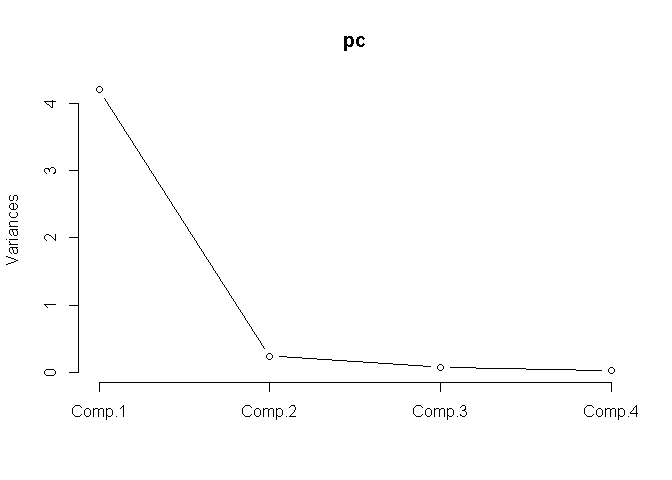
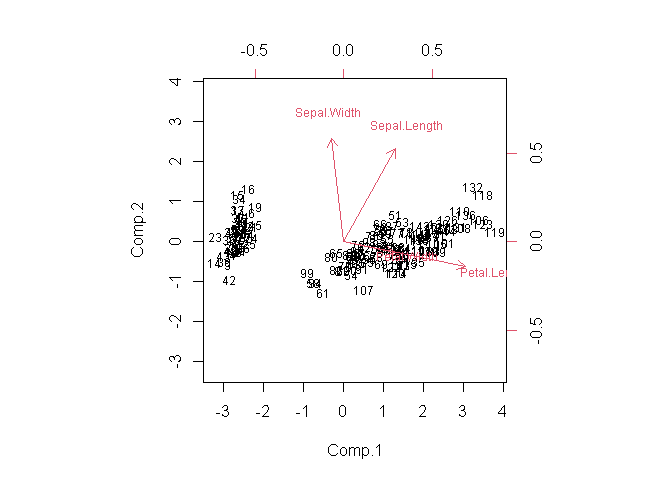
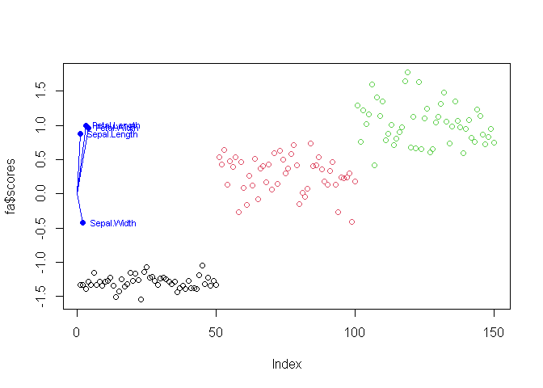

데이터 변환
================

# Prerequisite

``` r
rm(list=ls())
# getwd()
# setwd("./R") # if necessary
```

# 파생변수 생성

``` r
data <- iris
```

``` r
str(data)
```

    ## 'data.frame':    150 obs. of  5 variables:
    ##  $ Sepal.Length: num  5.1 4.9 4.7 4.6 5 5.4 4.6 5 4.4 4.9 ...
    ##  $ Sepal.Width : num  3.5 3 3.2 3.1 3.6 3.9 3.4 3.4 2.9 3.1 ...
    ##  $ Petal.Length: num  1.4 1.4 1.3 1.5 1.4 1.7 1.4 1.5 1.4 1.5 ...
    ##  $ Petal.Width : num  0.2 0.2 0.2 0.2 0.2 0.4 0.3 0.2 0.2 0.1 ...
    ##  $ Species     : Factor w/ 3 levels "setosa","versicolor",..: 1 1 1 1 1 1 1 1 1 1 ...

``` r
summary(data)
```

    ##   Sepal.Length    Sepal.Width     Petal.Length    Petal.Width          Species  
    ##  Min.   :4.300   Min.   :2.000   Min.   :1.000   Min.   :0.100   setosa    :50  
    ##  1st Qu.:5.100   1st Qu.:2.800   1st Qu.:1.600   1st Qu.:0.300   versicolor:50  
    ##  Median :5.800   Median :3.000   Median :4.350   Median :1.300   virginica :50  
    ##  Mean   :5.843   Mean   :3.057   Mean   :3.758   Mean   :1.199                  
    ##  3rd Qu.:6.400   3rd Qu.:3.300   3rd Qu.:5.100   3rd Qu.:1.800                  
    ##  Max.   :7.900   Max.   :4.400   Max.   :6.900   Max.   :2.500

``` r
data[sort(sample(1:nrow(data), 10)),]
```

    ##     Sepal.Length Sepal.Width Petal.Length Petal.Width    Species
    ## 16           5.7         4.4          1.5         0.4     setosa
    ## 44           5.0         3.5          1.6         0.6     setosa
    ## 56           5.7         2.8          4.5         1.3 versicolor
    ## 70           5.6         2.5          3.9         1.1 versicolor
    ## 80           5.7         2.6          3.5         1.0 versicolor
    ## 83           5.8         2.7          3.9         1.2 versicolor
    ## 98           6.2         2.9          4.3         1.3 versicolor
    ## 120          6.0         2.2          5.0         1.5  virginica
    ## 141          6.7         3.1          5.6         2.4  virginica
    ## 148          6.5         3.0          5.2         2.0  virginica

## 데이터셋에 직접 추가

``` r
# dataset$추가할변수 <- "추가할 내용"
data$new1 <- data$Sepal.Length + data$Sepal.Width
data[sort(sample(1:nrow(data), 10)),]
```

    ##     Sepal.Length Sepal.Width Petal.Length Petal.Width    Species new1
    ## 20           5.1         3.8          1.5         0.3     setosa  8.9
    ## 25           4.8         3.4          1.9         0.2     setosa  8.2
    ## 29           5.2         3.4          1.4         0.2     setosa  8.6
    ## 53           6.9         3.1          4.9         1.5 versicolor 10.0
    ## 79           6.0         2.9          4.5         1.5 versicolor  8.9
    ## 85           5.4         3.0          4.5         1.5 versicolor  8.4
    ## 87           6.7         3.1          4.7         1.5 versicolor  9.8
    ## 88           6.3         2.3          4.4         1.3 versicolor  8.6
    ## 95           5.6         2.7          4.2         1.3 versicolor  8.3
    ## 114          5.7         2.5          5.0         2.0  virginica  8.2

``` r
# dataset["추가할변수"] <-  "추가할 내용"
data["new2"] <- data$Petal.Length + data$Petal.Width
data[sort(sample(1:nrow(data), 10)),]
```

    ##     Sepal.Length Sepal.Width Petal.Length Petal.Width    Species new1 new2
    ## 34           5.5         4.2          1.4         0.2     setosa  9.7  1.6
    ## 71           5.9         3.2          4.8         1.8 versicolor  9.1  6.6
    ## 74           6.1         2.8          4.7         1.2 versicolor  8.9  5.9
    ## 110          7.2         3.6          6.1         2.5  virginica 10.8  8.6
    ## 114          5.7         2.5          5.0         2.0  virginica  8.2  7.0
    ## 120          6.0         2.2          5.0         1.5  virginica  8.2  6.5
    ## 125          6.7         3.3          5.7         2.1  virginica 10.0  7.8
    ## 129          6.4         2.8          5.6         2.1  virginica  9.2  7.7
    ## 138          6.4         3.1          5.5         1.8  virginica  9.5  7.3
    ## 142          6.9         3.1          5.1         2.3  virginica 10.0  7.4

## cbind()

``` r
# dataset <- cbind(dataset, 추가할변수 = "추가할 내용")
data <- cbind(data, new3 = data$Sepal.Length + data$Petal.Length)
data[sort(sample(1:nrow(data), 10)),]
```

    ##     Sepal.Length Sepal.Width Petal.Length Petal.Width    Species new1 new2 new3
    ## 16           5.7         4.4          1.5         0.4     setosa 10.1  1.9  7.2
    ## 26           5.0         3.0          1.6         0.2     setosa  8.0  1.8  6.6
    ## 90           5.5         2.5          4.0         1.3 versicolor  8.0  5.3  9.5
    ## 95           5.6         2.7          4.2         1.3 versicolor  8.3  5.5  9.8
    ## 111          6.5         3.2          5.1         2.0  virginica  9.7  7.1 11.6
    ## 112          6.4         2.7          5.3         1.9  virginica  9.1  7.2 11.7
    ## 125          6.7         3.3          5.7         2.1  virginica 10.0  7.8 12.4
    ## 128          6.1         3.0          4.9         1.8  virginica  9.1  6.7 11.0
    ## 147          6.3         2.5          5.0         1.9  virginica  8.8  6.9 11.3
    ## 149          6.2         3.4          5.4         2.3  virginica  9.6  7.7 11.6

## transform()

``` r
# dataset <- transform(dataset, var1 = data1, var2 = data2, ...)
data <- transform(data, new4 = data$Sepal.Width + data$Petal.Width)
data[sort(sample(1:nrow(data), 10)),]
```

    ##     Sepal.Length Sepal.Width Petal.Length Petal.Width    Species new1 new2 new3 new4
    ## 2            4.9         3.0          1.4         0.2     setosa  7.9  1.6  6.3  3.2
    ## 20           5.1         3.8          1.5         0.3     setosa  8.9  1.8  6.6  4.1
    ## 25           4.8         3.4          1.9         0.2     setosa  8.2  2.1  6.7  3.6
    ## 30           4.7         3.2          1.6         0.2     setosa  7.9  1.8  6.3  3.4
    ## 35           4.9         3.1          1.5         0.2     setosa  8.0  1.7  6.4  3.3
    ## 75           6.4         2.9          4.3         1.3 versicolor  9.3  5.6 10.7  4.2
    ## 95           5.6         2.7          4.2         1.3 versicolor  8.3  5.5  9.8  4.0
    ## 123          7.7         2.8          6.7         2.0  virginica 10.5  8.7 14.4  4.8
    ## 137          6.3         3.4          5.6         2.4  virginica  9.7  8.0 11.9  5.8
    ## 146          6.7         3.0          5.2         2.3  virginica  9.7  7.5 11.9  5.3

## within()

``` r
# dataset <- within(dataset, expr)
data <- within(data,
               {
                 new5 = ifelse(data$Sepal.Length>mean(data$Sepal.Length), "G", "L")
               })
data[sort(sample(1:nrow(data), 10)),]
```

    ##     Sepal.Length Sepal.Width Petal.Length Petal.Width    Species new1 new2 new3 new4 new5
    ## 4            4.6         3.1          1.5         0.2     setosa  7.7  1.7  6.1  3.3    L
    ## 7            4.6         3.4          1.4         0.3     setosa  8.0  1.7  6.0  3.7    L
    ## 31           4.8         3.1          1.6         0.2     setosa  7.9  1.8  6.4  3.3    L
    ## 74           6.1         2.8          4.7         1.2 versicolor  8.9  5.9 10.8  4.0    G
    ## 80           5.7         2.6          3.5         1.0 versicolor  8.3  4.5  9.2  3.6    L
    ## 86           6.0         3.4          4.5         1.6 versicolor  9.4  6.1 10.5  5.0    G
    ## 98           6.2         2.9          4.3         1.3 versicolor  9.1  5.6 10.5  4.2    G
    ## 101          6.3         3.3          6.0         2.5  virginica  9.6  8.5 12.3  5.8    G
    ## 114          5.7         2.5          5.0         2.0  virginica  8.2  7.0 10.7  4.5    L
    ## 117          6.5         3.0          5.5         1.8  virginica  9.5  7.3 12.0  4.8    G

# 변수 축소

## 주성분 분석

``` r
pc <- princomp(data[,c(1:4)])
summary(pc)
```

    ## Importance of components:
    ##                           Comp.1     Comp.2     Comp.3      Comp.4
    ## Standard deviation     2.0494032 0.49097143 0.27872586 0.153870700
    ## Proportion of Variance 0.9246187 0.05306648 0.01710261 0.005212184
    ## Cumulative Proportion  0.9246187 0.97768521 0.99478782 1.000000000

``` r
# screePlot
plot(pc, type = 'l')
```

<!-- -->

``` r
pc$loadings
```

    ## 
    ## Loadings:
    ##              Comp.1 Comp.2 Comp.3 Comp.4
    ## Sepal.Length  0.361  0.657  0.582  0.315
    ## Sepal.Width          0.730 -0.598 -0.320
    ## Petal.Length  0.857 -0.173        -0.480
    ## Petal.Width   0.358        -0.546  0.754
    ## 
    ##                Comp.1 Comp.2 Comp.3 Comp.4
    ## SS loadings      1.00   1.00   1.00   1.00
    ## Proportion Var   0.25   0.25   0.25   0.25
    ## Cumulative Var   0.25   0.50   0.75   1.00

``` r
biplot(pc, scale=0, cex = 0.75, arrow.len = 0.1, expand=1)
```

<!-- -->

## 요인 분석

``` r
# 정규화
data.min <- sapply(data[,c(1:4)],min)
data.max <- sapply(data[,c(1:4)],max)
data.scaled <- scale(data[,c(1:4)], center = data.min, scale = (data.max - data.min))
fa <- factanal(data.scaled[,c(1:4)], factors = 1, scores="regression")
fa
```

    ## 
    ## Call:
    ## factanal(x = data.scaled[, c(1:4)], factors = 1, scores = "regression")
    ## 
    ## Uniquenesses:
    ## Sepal.Length  Sepal.Width Petal.Length  Petal.Width 
    ##        0.240        0.822        0.005        0.069 
    ## 
    ## Loadings:
    ##              Factor1
    ## Sepal.Length  0.872 
    ## Sepal.Width  -0.422 
    ## Petal.Length  0.998 
    ## Petal.Width   0.965 
    ## 
    ##                Factor1
    ## SS loadings      2.864
    ## Proportion Var   0.716
    ## 
    ## Test of the hypothesis that 1 factor is sufficient.
    ## The chi square statistic is 85.51 on 2 degrees of freedom.
    ## The p-value is 2.7e-19

``` r
plot(fa$scores, col=data$Species)
# text(fa$scores[,1], cex = 0.7, pos = 3, col = "blue")
points(fa$loadings, pch=19, col="blue")
text(fa$loadings[,1], labels = rownames(fa$loadings),
     cex = 0.7, pos = 4, col = "blue")
segments(0,0,1, fa$loadings[1,1], col="blue")
segments(0,0,2, fa$loadings[2,1], col="blue")
segments(0,0,3, fa$loadings[3,1], col="blue")
segments(0,0,4, fa$loadings[4,1], col="blue")
```

<!-- -->

# 표준화와 정규화

## 표준화

``` r
# 평균 기준 떨어진 정도
SL <- data.frame(Sepal.Length = iris$Sepal.Length)
SL$mean <- mean(SL$Sepal.Length)
SL$sd <- sd(SL$Sepal.Length)

# 직접계산: (원소값 - 평균)/표준편차
SL$stndM <- (SL$Sepal.Length - SL$mean)/SL$sd 

# scale() 사용
SL$stndA <- scale(SL$Sepal.Length, center = T, scale = T) 
SL[sort(sample(1:nrow(SL), 10)),]
```

    ##     Sepal.Length     mean        sd       stndM       stndA
    ## 16           5.7 5.843333 0.8280661 -0.17309407 -0.17309407
    ## 39           4.4 5.843333 0.8280661 -1.74301699 -1.74301699
    ## 41           5.0 5.843333 0.8280661 -1.01843718 -1.01843718
    ## 48           4.6 5.843333 0.8280661 -1.50149039 -1.50149039
    ## 55           6.5 5.843333 0.8280661  0.79301235  0.79301235
    ## 59           6.6 5.843333 0.8280661  0.91377565  0.91377565
    ## 79           6.0 5.843333 0.8280661  0.18919584  0.18919584
    ## 93           5.8 5.843333 0.8280661 -0.05233076 -0.05233076
    ## 124          6.3 5.843333 0.8280661  0.55148575  0.55148575
    ## 128          6.1 5.843333 0.8280661  0.30995914  0.30995914

## 정규화

``` r
# 데이터의 범위를 0과 1 사이로 변환
SW <- data.frame(Sepal.Width = iris$Sepal.Width)
SW.min <- min(SW)
SW$min <- SW.min
SW.max <- max(SW)
SW$max <- SW.max
```

``` r
# 직접계산: (원소값 - 최소값)/(최대값-최소값)
normalize <- function(x) {
  return((x - min(x)) / (max(x)-min(x)))
}
SW$nrmlM <- normalize(SW$Sepal.Width)
SW[sort(sample(1:nrow(SW), 10)),]
```

    ##     Sepal.Width min max     nrmlM
    ## 2           3.0   2 4.4 0.4166667
    ## 84          2.7   2 4.4 0.2916667
    ## 86          3.4   2 4.4 0.5833333
    ## 88          2.3   2 4.4 0.1250000
    ## 91          2.6   2 4.4 0.2500000
    ## 96          3.0   2 4.4 0.4166667
    ## 99          2.5   2 4.4 0.2083333
    ## 111         3.2   2 4.4 0.5000000
    ## 144         3.2   2 4.4 0.5000000
    ## 150         3.0   2 4.4 0.4166667

``` r
# scale() 사용
SW$nrmlA <- scale(SW$Sepal.Width, center = SW.min, scale = SW.max - SW.min)
SW[sort(sample(1:nrow(SW), 10)),]
```

    ##     Sepal.Width min max     nrmlM     nrmlA
    ## 5           3.6   2 4.4 0.6666667 0.6666667
    ## 18          3.5   2 4.4 0.6250000 0.6250000
    ## 25          3.4   2 4.4 0.5833333 0.5833333
    ## 30          3.2   2 4.4 0.5000000 0.5000000
    ## 60          2.7   2 4.4 0.2916667 0.2916667
    ## 61          2.0   2 4.4 0.0000000 0.0000000
    ## 73          2.5   2 4.4 0.2083333 0.2083333
    ## 98          2.9   2 4.4 0.3750000 0.3750000
    ## 143         2.7   2 4.4 0.2916667 0.2916667
    ## 150         3.0   2 4.4 0.4166667 0.4166667

-----

EOD
