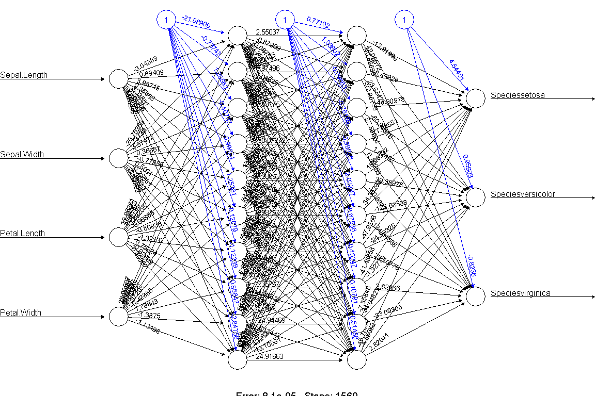
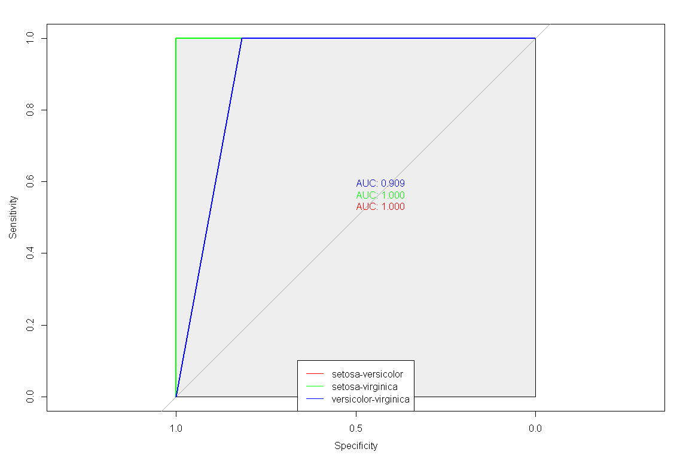

Untitled
================

# 메모리 정리

``` r
rm(list=ls())
```

# 데이터 읽어 오기

``` r
data(iris)
```

# EDA

``` r
str(iris)
```

    ## 'data.frame':    150 obs. of  5 variables:
    ##  $ Sepal.Length: num  5.1 4.9 4.7 4.6 5 5.4 4.6 5 4.4 4.9 ...
    ##  $ Sepal.Width : num  3.5 3 3.2 3.1 3.6 3.9 3.4 3.4 2.9 3.1 ...
    ##  $ Petal.Length: num  1.4 1.4 1.3 1.5 1.4 1.7 1.4 1.5 1.4 1.5 ...
    ##  $ Petal.Width : num  0.2 0.2 0.2 0.2 0.2 0.4 0.3 0.2 0.2 0.1 ...
    ##  $ Species     : Factor w/ 3 levels "setosa","versicolor",..: 1 1 1 1 1 1 1 1 1 1 ...

``` r
summary(iris)
```

    ##   Sepal.Length    Sepal.Width     Petal.Length    Petal.Width          Species  
    ##  Min.   :4.300   Min.   :2.000   Min.   :1.000   Min.   :0.100   setosa    :50  
    ##  1st Qu.:5.100   1st Qu.:2.800   1st Qu.:1.600   1st Qu.:0.300   versicolor:50  
    ##  Median :5.800   Median :3.000   Median :4.350   Median :1.300   virginica :50  
    ##  Mean   :5.843   Mean   :3.057   Mean   :3.758   Mean   :1.199                  
    ##  3rd Qu.:6.400   3rd Qu.:3.300   3rd Qu.:5.100   3rd Qu.:1.800                  
    ##  Max.   :7.900   Max.   :4.400   Max.   :6.900   Max.   :2.500

``` r
rbind(head(iris,3), tail(iris,3))
```

    ##     Sepal.Length Sepal.Width Petal.Length Petal.Width   Species
    ## 1            5.1         3.5          1.4         0.2    setosa
    ## 2            4.9         3.0          1.4         0.2    setosa
    ## 3            4.7         3.2          1.3         0.2    setosa
    ## 148          6.5         3.0          5.2         2.0 virginica
    ## 149          6.2         3.4          5.4         2.3 virginica
    ## 150          5.9         3.0          5.1         1.8 virginica

``` r
colSums(is.na(iris))
```

    ## Sepal.Length  Sepal.Width Petal.Length  Petal.Width      Species 
    ##            0            0            0            0            0

# 데이터 전처리

``` r
# Species를 종별로 변수 생성 (one hot encoding)
iris.nn <- cbind(iris, model.matrix(~ 0 + Species, iris))
head(iris.nn, 3)
```

    ##   Sepal.Length Sepal.Width Petal.Length Petal.Width Species Speciessetosa Speciesversicolor Speciesvirginica
    ## 1          5.1         3.5          1.4         0.2  setosa             1                 0                0
    ## 2          4.9         3.0          1.4         0.2  setosa             1                 0                0
    ## 3          4.7         3.2          1.3         0.2  setosa             1                 0                0

``` r
# 훈련/검정 데이터 분리
idx <- sample(nrow(iris.nn), nrow(iris.nn)*0.75, replace = F)
iris.train <- iris.nn[idx, ]
iris.test <- iris.nn[-idx, ]
```

# 모델링

``` r
# install.packages("neuralnet")
library(neuralnet)

# formula
model.formula <- as.formula(
  paste(paste(colnames(iris.train[,c(6:8)]), collapse = "+"), "~", paste(colnames(iris.train[,c(1:4)]), collapse = "+"))
)
model.nn <- neuralnet(model.formula, data = iris.train, hidden = c(10,10), rep = 5, err.fct = "ce",
                      linear.output = F, lifesign = "minimal", stepmax = 100000, threshold = 0.001)
```

``` r
plot(model.nn, rep="best")
```

<!-- -->

# 성과분석

``` r
predict.nn <- compute(model.nn, iris.test[1:4])
idx <- apply(predict.nn$net.result, MARGIN = 1, which.max)
predicted <- c("setosa", "versicolor", "virginica")[idx]
```

``` r
library(caret)
confusionMatrix(as.factor(predicted), iris.test$Species)
```

    ## Confusion Matrix and Statistics
    ## 
    ##             Reference
    ## Prediction   setosa versicolor virginica
    ##   setosa         14          0         0
    ##   versicolor      0          9         2
    ##   virginica       0          0        13
    ## 
    ## Overall Statistics
    ##                                           
    ##                Accuracy : 0.9474          
    ##                  95% CI : (0.8225, 0.9936)
    ##     No Information Rate : 0.3947          
    ##     P-Value [Acc > NIR] : 7.82e-13        
    ##                                           
    ##                   Kappa : 0.9203          
    ##                                           
    ##  Mcnemar's Test P-Value : NA              
    ## 
    ## Statistics by Class:
    ## 
    ##                      Class: setosa Class: versicolor Class: virginica
    ## Sensitivity                 1.0000            1.0000           0.8667
    ## Specificity                 1.0000            0.9310           1.0000
    ## Pos Pred Value              1.0000            0.8182           1.0000
    ## Neg Pred Value              1.0000            1.0000           0.9200
    ## Prevalence                  0.3684            0.2368           0.3947
    ## Detection Rate              0.3684            0.2368           0.3421
    ## Detection Prevalence        0.3684            0.2895           0.3421
    ## Balanced Accuracy           1.0000            0.9655           0.9333

``` r
library(pROC)
model.roc <- multiclass.roc(as.numeric(as.factor(predicted)), as.numeric(iris.test$Species))
plot.roc(model.roc$rocs[[1]], col="red", print.auc = T, print.auc.adj = c(0,-1), max.auc.polygon = T)
plot.roc(model.roc$rocs[[2]], col="green", print.auc = T, print.auc.adj = c(0,-2.5), add = T)
plot.roc(model.roc$rocs[[3]], col="blue", print.auc = T, print.auc.adj = c(0,-4.0), add = T)
legend("bottom", legend = c("setosa-versicolor", "setosa-virginica", "versicolor-virginica"), col = c("red", "green", "blue"), lwd=1)
```

<!-- -->
