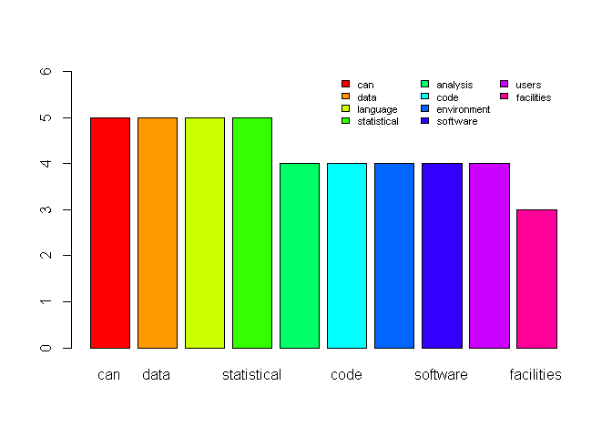
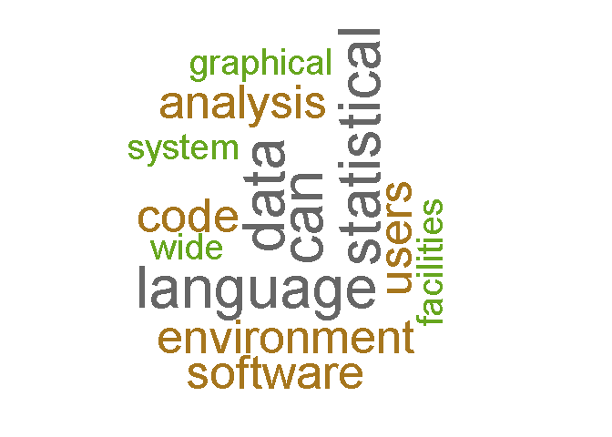

text mining
================

# Preliminary work

``` r
rm(list=ls())
# getwd()
# setwd("./R") # if necessary
```

# Reading Data

``` r
r <- readLines("about R.txt")
```

# EDA

``` r
# install.packages("tm")
# install.packages("wordcloud")
library(tm)
library(wordcloud)

# load data as corpus
r.cp <- VCorpus(VectorSource(r))
```

# Preprocessing Data

``` r
# cleaning up data
stopword <- stopwords(kind = 'en')
preprocessing_corpus <- function(x) {
  x <- tm_map(x, removePunctuation)
  x <- tm_map(x, removeNumbers)
  x <- tm_map(x, stripWhitespace)
  x <- tm_map(x, content_transformer(tolower))
  x <- tm_map(x, removeWords, stopword)
  return(x)
}

r.cp.prep <- preprocessing_corpus(r.cp)

# build term document matrix
r.tdm <- TermDocumentMatrix(r.cp.prep)
r.tdm.mtx <- as.matrix(r.tdm)
r.tdm.mtx.sorted <- sort(rowSums(r.tdm.mtx), decreasing = T)
r.tdm.mtx.sorted[1:10]
```

    ##         can        data    language statistical    analysis        code 
    ##           5           5           5           5           4           4 
    ## environment    software       users  facilities 
    ##           4           4           4           3

``` r
# draw barplot
colors = rainbow(10)
barplot(r.tdm.mtx.sorted[1:10], col = colors, ylim = c(0,6))
legend("topright", names(r.tdm.mtx.sorted[1:10]), fill = colors, bty ="n", ncol = 3, cex = 0.7)
```

<!-- -->

``` r
# wordcloud
set.seed(1234)
wordcloud(names(r.tdm.mtx.sorted), r.tdm.mtx.sorted, min.freq = 3, random.order = F, rot.per=0.35, colors = brewer.pal(8, "Dark2"), scale = c(4, 0.3))
```

<!-- -->

-----

EOD
