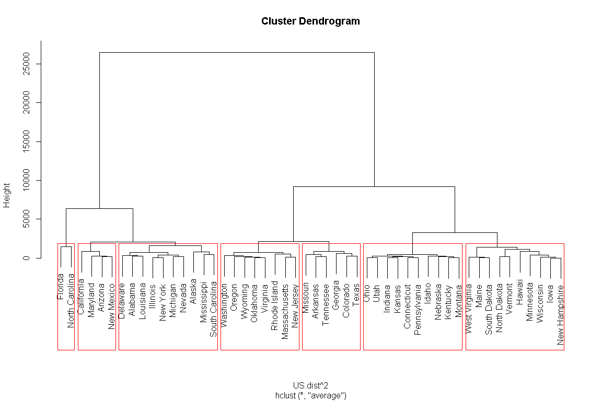

군집분석
================

# Prerequisite

``` r
rm(list=ls())
# getwd()
# setwd("./R") # if necessary

viewSamples <- function(x,n=5) {
  x[sort(sample(1:nrow(x), n)),]
}
```

# 군집분석 (Cluster analysis)

`군집분석`은 각 개체의 유사성을 측정하여 유사성이 높은 대상 집단을 분류하고 군집에 속한 객체들의 유사성과 서로 다른 군집에
속한 개체간의 상이성을 규명하는 다변량 분석 기법이다.

## 계층적 군집분석

``` r
US <- USArrests
US.dist <- dist(US, "euclidean")
US.dist
```

    ##                   Alabama     Alaska    Arizona   Arkansas California   Colorado Connecticut   Delaware    Florida
    ## Alaska          37.177009                                                                                         
    ## Arizona         63.008333  46.592489                                                                              
    ## Arkansas        46.928137  77.197409 108.851918                                                                   
    ## California      55.524769  45.102217  23.194180  97.582017                                                        
    ## Colorado        41.932565  66.475935  90.351148  36.734861  73.197131                                             
    ## Connecticut    128.206942 159.406556 185.159526  85.028289 169.277110  98.081191                                  
    ## Delaware        16.806249  45.182961  58.616380  53.010376  49.291480  41.477825  128.210179                      
    ## Florida        102.001618  79.974496  41.654532 148.735739  60.980735 131.405822  226.303005  99.108325           
    ## Georgia         25.841827  57.030255  86.037957  25.586129  73.997297  25.093027  104.426529  33.245300 125.766490
    ## Hawaii         191.803050 221.193535 248.268967 147.775979 231.071093 159.179176   64.952367 192.366109 289.428575
    ## Idaho          116.761980 146.484982 176.817674  70.587038 162.612792  90.886413   25.280427 119.421313 217.665179
    ## Illinois        28.454877  42.911653  45.697812  67.770274  32.718802  47.669068  139.906469  18.151859  86.558708
    ## Indiana        123.345207 152.804090 181.897801  78.478086 166.229961  93.615063   16.316250 125.310534 222.923866
    ## Iowa           180.610105 209.983523 239.991458 134.594948 224.634659 152.079749   57.595573 182.709989 281.013523
    ## Kansas         121.519875 151.480197 180.028914  76.753436 164.516747  92.179716   14.173920 123.165945 221.082722
    ## Kentucky       127.284170 156.612037 187.690303  81.092848 173.207910 101.024749   26.343880 130.597435 228.332762
    ## Louisiana       15.454449  32.348879  48.494639  61.545512  41.635562  49.974994  140.398077  16.976749  87.670348
    ## Maine          154.145289 183.897526 214.327413 107.850730 199.931113 127.900156   37.647443 156.666652 255.152307
    ## Maryland        64.993615  44.839492  15.015991 111.642913  36.347352  97.300411  191.161947  63.577984  37.783859
    ## Massachusetts   91.648513 123.254209 145.875906  54.181178 129.524708  59.900000   40.165284  89.958324 187.043738
    ## Michigan        28.485435  28.857755  39.872422  71.100281  27.746351  51.454835  147.266561  26.531679  80.356269
    ## Minnesota      164.650964 194.253571 223.088256 119.324641 207.222537 134.764535   39.746698 166.141656 264.225831
    ## Mississippi     27.390144  28.635118  52.708728  69.685364  55.683570  68.664401  153.263955  36.479172  85.390456
    ## Missouri        59.788293  89.306719 116.467377  24.894377 100.988910  29.179788   70.695827  61.378905 157.491746
    ## Montana        127.392621 156.673578 187.540849  81.163107 172.996069 100.751675   24.746313 130.393136 228.327856
    ## Nebraska       134.436974 164.114259 193.423602  88.978930 178.100814 105.668349   17.865050 136.378334 234.464006
    ## Nevada          37.430469  34.886817  44.797433  74.288694  26.746962  48.834209  146.551083  35.053245  84.255860
    ## New Hampshire  179.736196 209.254415 239.255616 133.678308 224.055395 151.589182   57.043843 181.854695 280.247480
    ## New Jersey      83.243018 114.735566 135.850396  49.844257 119.041169  50.420829   51.196680  80.877995 176.897174
    ## New Mexico      51.643489  33.521933  13.896043  97.931200  24.495102  81.736222  176.580322  50.089320  51.147238
    ## New York        33.710829  43.182983  40.853519  73.762118  26.900929  52.278102  145.268166  24.189461  81.542198
    ## North Carolina 101.961022  79.376067  57.619615 147.184238  80.332123 138.977588  229.504009 102.861557  38.527912
    ## North Dakota   192.416138 221.378590 252.808188 145.855545 238.214462 165.750928   73.038962 195.272271 293.622751
    ## Ohio           117.387606 147.373335 174.338177  74.369752 157.998513  85.817539   15.036289 118.179186 215.466610
    ## Oklahoma        85.848704 116.429421 143.931407  43.012673 128.779346  57.099737   43.036031  87.195929 184.983918
    ## Oregon          78.386861 106.930117 135.672879  36.895122 120.039577  47.364121   53.242840  80.307223 176.810661
    ## Pennsylvania   131.085087 161.600897 188.866222  86.990862 172.999364 101.039596    8.027453 132.003674 229.949581
    ## Rhode Island    70.338112 103.903802 122.418871  42.185305 107.213106  43.879494   64.837104  66.208006 163.312461
    ## South Carolina  44.182915  27.556487  36.890920  89.248866  47.061343  82.641939  172.206765  48.725148  65.187115
    ## South Dakota   151.089113 179.948131 211.751576 104.455206 197.524378 125.302115   40.039231 154.422829 252.438844
    ## Tennessee       48.347596  77.884530 108.258117  12.614278  94.727662  28.005892   82.192761  53.343228 148.592867
    ## Texas           41.566092  72.362214  93.275988  32.744618  77.380230  14.501034   92.659160  39.665224 134.179917
    ## Utah           118.502700 148.276094 174.257338  76.438995 157.492635  85.625522   15.755951 118.514556 215.533849
    ## Vermont        190.370691 218.290472 251.489264 143.528569 237.435465 165.047690   76.617361 194.254601 292.020085
    ## Virginia        80.295330 110.646690 139.424711  36.421560 124.820912  53.416851   49.307200  82.678716 180.286023
    ## Washington      92.820472 122.147002 149.297857  51.204785 133.106574  60.642065   38.334058  93.604327 190.555635
    ## West Virginia  156.792411 185.640863 218.006078 110.071113 204.253715 132.360115   47.895720 160.562418 258.460539
    ## Wisconsin      183.775733 213.575397 242.312381 138.344245 226.457502 154.115217   58.056696 185.194195 283.423799
    ## Wyoming         75.507086 106.740105 135.380390  30.987255 121.720335  52.036718   54.060152  77.934909 176.112606
    ##                   Georgia     Hawaii      Idaho   Illinois    Indiana       Iowa     Kansas   Kentucky  Louisiana
    ## Alaska                                                                                                           
    ## Arizona                                                                                                          
    ## Arkansas                                                                                                         
    ## California                                                                                                       
    ## Colorado                                                                                                         
    ## Connecticut                                                                                                      
    ## Delaware                                                                                                         
    ## Florida                                                                                                          
    ## Georgia                                                                                                          
    ## Hawaii         167.128005                                                                                        
    ## Idaho           93.116057  79.751426                                                                             
    ## Illinois        45.002667 203.099606 132.811445                                                                  
    ## Indiana         98.772871  69.406412  15.407790 137.256111                                                       
    ## Iowa           156.445805  29.407822  64.137119 195.329286  58.584042                                            
    ## Kansas          97.174071  71.100844  13.964240 135.278823   3.929377  60.177487                                 
    ## Kentucky       103.041448  70.459705  13.409698 143.599373  14.606163  53.993055  15.766420                      
    ## Louisiana       38.690567 203.970611 130.433278  17.811232 136.255936 193.966621 134.394940 140.937220           
    ## Maine          130.472564  50.566788  37.672404 170.033320  36.003472  27.879383  36.989863  28.407921 167.825058
    ## Maryland        89.505363 254.687573 181.189542  53.593376 187.179192 244.930725 185.337881 191.939600  51.479802
    ## Massachusetts   68.762272 103.097139  42.539981 100.495224  41.544314  97.277130  39.018585  52.125713 102.551499
    ## Michigan        47.398101 209.833863 138.390968  15.591664 143.065789 201.381355 141.398798 148.859665  16.652327
    ## Minnesota      140.327830  31.620405  49.482320 178.213636  41.706834  18.713899  43.237715  40.199005 177.605124
    ## Mississippi     51.355428 216.832308 140.041637  41.244394 147.822258 203.972670 146.023354 150.351588  24.708298
    ## Missouri        35.571337 132.931148  62.104428  72.315973  65.613108 124.035680  64.015936  72.298686  71.651657
    ## Montana        103.302081  69.885120  11.764353 143.447273  13.512957  53.529898  14.406943   3.834058 141.035457
    ## Nebraska       110.195735  59.930710  19.904271 148.806787  12.596031  46.609548  13.789126  13.349157 147.582858
    ## Nevada          50.567579 207.733603 138.767431  22.366046 142.221658 200.738860 140.770878 148.923940  28.472443
    ## New Hampshire  155.665603  31.220666  63.208702 194.607657  58.096988   2.291288  59.594127  53.141321 193.137723
    ## New Jersey      60.778286 113.187323  52.822344  90.399336  51.931493 108.241813  49.674943  62.293980  93.298231
    ## New Mexico      75.177723 239.726553 166.969608  39.135789 172.481448 230.493557 170.716051 177.630318  37.762548
    ## New York        50.643657 208.186095 138.541907   6.236986 142.699755 200.856292 140.757309 149.261515  21.417283
    ## North Carolina 127.335973 293.600238 217.443717  96.214188 225.019221 281.504316 223.108964 228.131388  90.708158
    ## North Dakota   168.611417  41.335941  75.999013 208.585834  72.757474  17.548789  74.333909  65.728304 206.240563
    ## Ohio            92.883637  74.467711  22.692069 129.311136  12.213517  67.439009  10.920165  26.110726 129.569479
    ## Oklahoma        61.759858 106.074172  34.736724  99.294713  38.136072  96.130380  36.115924  45.202876  98.439220
    ## Oregon          54.050902 114.490043  43.855444  91.729712  46.842075 105.072784  45.452173  54.009629  90.893674
    ## Pennsylvania   106.822376  61.237978  23.112334 143.769329  11.662761  52.485903  11.256109  20.555291 143.600487
    ## Rhode Island    50.992647 128.628224  63.564534  77.048621  66.187083 121.796716  63.425941  74.523084  80.020060
    ## South Carolina  69.194581 235.800975 159.765860  46.295248 167.030207 223.795174 165.259826 170.224939  35.001286
    ## South Dakota   127.294776  55.686713  35.219313 167.874953  34.753417  32.385336  36.247483  25.001200 165.023998
    ## Tennessee       23.427548 144.385941  70.161599  65.675338  75.708718 133.388005  74.222975  80.091260  61.619234
    ## Texas           22.851258 155.296008  86.410069  48.171984  89.551661 147.871194  87.710547  96.652160  50.181471
    ## Utah            94.292364  74.139733  27.423530 129.240280  17.135052  68.996812  15.901258  31.477135 130.331616
    ## Vermont        166.724923  51.919264  75.346931 207.925660  73.722724  26.249000  75.535952  64.832554 204.578200
    ## Virginia        56.028743 111.850302  38.132139  95.202416  43.067157 100.816913  41.273963  48.485049  93.315915
    ## Washington      68.590962  99.692979  33.644613 104.698615  33.545193  91.663788  31.941196  43.214581 104.933122
    ## West Virginia  133.229651  57.271022  42.185543 174.350738  42.885196  31.068473  44.280696  31.906112 170.919572
    ## Wisconsin      159.511880  20.824265  68.151009 197.332410  61.042608   9.508417  62.509199  58.417977 196.748062
    ## Wyoming         52.119094 117.377212  41.672533  91.414003  48.562537 105.231412  46.458584  52.696300  88.867992
    ##                     Maine   Maryland Massachusetts   Michigan  Minnesota Mississippi   Missouri    Montana   Nebraska
    ## Alaska                                                                                                               
    ## Arizona                                                                                                              
    ## Arkansas                                                                                                             
    ## California                                                                                                           
    ## Colorado                                                                                                             
    ## Connecticut                                                                                                          
    ## Delaware                                                                                                             
    ## Florida                                                                                                              
    ## Georgia                                                                                                              
    ## Hawaii                                                                                                               
    ## Idaho                                                                                                                
    ## Illinois                                                                                                             
    ## Indiana                                                                                                              
    ## Iowa                                                                                                                 
    ## Kansas                                                                                                               
    ## Kentucky                                                                                                             
    ## Louisiana                                                                                                            
    ## Maine                                                                                                                
    ## Maryland       218.699886                                                                                            
    ## Massachusetts   74.763226 152.659294                                                                                 
    ## Michigan       175.949680  46.129492    108.488386                                                                   
    ## Minnesota       19.919086 228.528707     79.340091 184.524795                                                        
    ## Mississippi    176.939227  48.451316    117.976820  35.440090 188.778706                                             
    ## Missouri        99.246007 122.059207     35.053816  77.473996 107.091456   86.084958                                 
    ## Montana         27.733914 191.924595     51.250073 148.808266  39.384515  150.610425  72.098821                      
    ## Nebraska        23.717715 198.508665     52.326380 154.789535  30.349959  158.469555  77.453083  11.528226           
    ## Nevada         176.131343  53.217009    107.554312  13.297368 183.527818   47.627933  76.968045 148.820697 154.251937
    ## New Hampshire   26.530925 244.109668     96.729158 200.707150  18.828701  202.982167 123.427307  52.686051  45.987390
    ## New Jersey      85.843404 143.042686     11.456439  98.634578  90.195898  110.016272  28.511752  61.674306  63.189398
    ## New Mexico     204.553123  15.890249    137.911711  30.421867 213.907760   39.988623 107.097946 177.596875 183.974917
    ## New York       175.732439  49.798896    105.673696  15.066519 183.630063   43.531598  77.722712 149.111032 154.332109
    ## North Carolina 254.439973  44.640565    192.400624  89.032634 266.032949   78.074388 161.457146 228.247870 235.774999
    ## North Dakota    38.664454 257.069057    112.209447 214.244090  35.698319  214.769947 137.364661  65.474041  60.579617
    ## Ohio            46.443514 180.335687     31.231715 135.781921  49.481411  142.751287  58.635569  25.133444  22.934908
    ## Oklahoma        71.288779 149.281379     17.650212 105.405218  79.285686  111.079521  28.390139  44.747290  49.543314
    ## Oregon          80.635538 141.153144     24.356724  96.697880  88.216778  103.938828  19.698223  53.512802  58.636166
    ## Pennsylvania    32.218783 194.556958     44.984108 150.488139  34.712534  155.864942  73.295157  19.296114  11.070682
    ## Rhode Island    97.872059 129.300657     26.343880  86.740590 104.350611   96.502487  27.062335  73.846936  76.661920
    ## South Carolina 196.957813  28.977578    135.674021  37.630440 208.249010   21.167192 103.666050 170.390053 177.941030
    ## South Dakota     8.537564 215.780560     74.710173 173.113200  25.349951  173.492882  96.711943  24.714368  23.641912
    ## Tennessee      107.596561 112.305031     48.854887  69.155260 117.299829   73.283354  15.502580  80.243941  87.134207
    ## Texas          123.250355  99.886185     53.689198  55.177169 130.573198   68.863053  25.494705  96.543772 101.373369
    ## Utah            49.388460 180.716961     30.182777 135.974446  50.638424  144.281149  59.377858  30.001500  26.271087
    ## Vermont         39.969613 255.122265    114.196541 212.796194  41.784447  211.879730 136.672016  64.834250  62.036280
    ## Virginia        75.368229 144.257582     23.857284 100.709086  84.452827  105.074830  24.279621  48.308798  54.334888
    ## Washington      68.338642 155.296008     16.067669 110.660833  74.211724  118.601096  33.570821  42.379712  45.433248
    ## West Virginia   12.775367 221.627187     82.405643 179.464760  29.160933  178.544112 103.624804  32.101402  31.996875
    ## Wisconsin       33.678628 247.739157     98.033107 203.835080  19.437592  207.706379 126.430692  57.861213  49.521510
    ## Wyoming         79.043849 139.782295     27.843312  97.161412  89.298936   99.743371  23.507446  52.481235  59.093654
    ##                    Nevada New Hampshire New Jersey New Mexico   New York North Carolina North Dakota       Ohio
    ## Alaska                                                                                                         
    ## Arizona                                                                                                        
    ## Arkansas                                                                                                       
    ## California                                                                                                     
    ## Colorado                                                                                                       
    ## Connecticut                                                                                                    
    ## Delaware                                                                                                       
    ## Florida                                                                                                        
    ## Georgia                                                                                                        
    ## Hawaii                                                                                                         
    ## Idaho                                                                                                          
    ## Illinois                                                                                                       
    ## Indiana                                                                                                        
    ## Iowa                                                                                                           
    ## Kansas                                                                                                         
    ## Kentucky                                                                                                       
    ## Louisiana                                                                                                      
    ## Maine                                                                                                          
    ## Maryland                                                                                                       
    ## Massachusetts                                                                                                  
    ## Michigan                                                                                                       
    ## Minnesota                                                                                                      
    ## Mississippi                                                                                                    
    ## Missouri                                                                                                       
    ## Montana                                                                                                        
    ## Nebraska                                                                                                       
    ## Nevada                                                                                                         
    ## New Hampshire  200.210539                                                                                      
    ## New Jersey      97.344132    107.738480                                                                        
    ## New Mexico      37.467986    229.732997 128.179132                                                             
    ## New York        20.645096    200.163833  95.399057  35.399011                                                  
    ## North Carolina  97.034272    280.505561 183.462939  59.896244  93.132218                                       
    ## North Dakota   214.115973     17.161876 123.275342 242.906155 214.253425     292.388919                        
    ## Ohio           134.495985     67.071976  41.518309 165.472959 134.586515     219.202144    82.626025           
    ## Oklahoma       105.249038     95.448939  22.518437 134.645646 104.835395     187.566442   109.576138  31.819019
    ## Oregon          95.797599    104.522151  24.505102 126.234266  97.132281     180.021804   118.430613  40.659193
    ## Pennsylvania   149.663021     51.998077  55.806989 179.907893 149.159244     232.672151    67.771749  15.755951
    ## Rhode Island    87.285337    121.050114  18.848077 115.067111  82.323326     168.777961   136.006470  56.980874
    ## South Carolina  48.734895    222.863837 127.057821  24.923082  45.747678      58.445872   234.921263 161.436117
    ## South Dakota   173.276657     31.237477  85.521693 201.633951 173.594873     251.190227    41.487950  46.284015
    ## Tennessee       70.326453    132.649802  42.898135  97.776684  71.344586     150.045593   145.643125  70.321121
    ## Texas           54.977268    147.242521  43.794749  84.860179  53.365907     140.746048   161.569954  81.436908
    ## Utah           134.311615     68.744236  40.453059 165.761515 134.404799     220.127872    84.676561   6.637771
    ## Vermont        212.903828     25.688519 125.119143 241.110867 213.666141     289.535231    13.044922  84.634804
    ## Virginia       100.964251    100.081966  26.264425 129.724207 100.841063     182.006621   113.669917  37.972753
    ## Washington     109.417914     91.189363  22.766642 140.351594 110.001909     194.501954   105.869967  25.747427
    ## West Virginia  179.983721     29.631065  93.151167 207.676022 180.137170     256.264570    36.728871  54.460720
    ## Wisconsin      202.872374     10.860018 108.867075 233.176178 202.749451     285.014473    23.737944  68.588993
    ## Wyoming         98.363205    104.361391  29.250641 125.576311  97.230345     176.747532   117.545268  44.044182
    ##                  Oklahoma     Oregon Pennsylvania Rhode Island South Carolina South Dakota  Tennessee      Texas
    ## Alaska                                                                                                          
    ## Arizona                                                                                                         
    ## Arkansas                                                                                                        
    ## California                                                                                                      
    ## Colorado                                                                                                        
    ## Connecticut                                                                                                     
    ## Delaware                                                                                                        
    ## Florida                                                                                                         
    ## Georgia                                                                                                         
    ## Hawaii                                                                                                          
    ## Idaho                                                                                                           
    ## Illinois                                                                                                        
    ## Indiana                                                                                                         
    ## Iowa                                                                                                            
    ## Kansas                                                                                                          
    ## Kentucky                                                                                                        
    ## Louisiana                                                                                                       
    ## Maine                                                                                                           
    ## Maryland                                                                                                        
    ## Massachusetts                                                                                                   
    ## Michigan                                                                                                        
    ## Minnesota                                                                                                       
    ## Mississippi                                                                                                     
    ## Missouri                                                                                                        
    ## Montana                                                                                                         
    ## Nebraska                                                                                                        
    ## Nevada                                                                                                          
    ## New Hampshire                                                                                                   
    ## New Jersey                                                                                                      
    ## New Mexico                                                                                                      
    ## New York                                                                                                        
    ## North Carolina                                                                                                  
    ## North Dakota                                                                                                    
    ## Ohio                                                                                                            
    ## Oklahoma                                                                                                        
    ## Oregon          12.424975                                                                                       
    ## Pennsylvania    45.465371  55.166294                                                                            
    ## Rhode Island    32.204503  32.684094    70.006928                                                               
    ## South Carolina 129.811748 122.055274   175.009628   113.440028                                                  
    ## South Dakota    69.380689  78.015768    33.758851    97.613575     193.557356                                   
    ## Tennessee       39.257738  31.299361    84.170125    37.709415      91.775814   104.341602                      
    ## Texas           52.071681  44.813837    96.136986    34.063617      84.379441   121.204373  24.742878           
    ## Utah            33.540572  41.639524    18.264994    56.375527     162.574906    49.833423  71.979164  81.596630
    ## Vermont        109.552727 117.817231    70.671777   137.516726     232.149801    40.225862 143.862747 161.331150
    ## Virginia         7.355270  10.579225    51.180856    32.859854     124.064701    72.859454  33.174237  48.525045
    ## Washington      10.305338  15.569843    40.681445    36.847931     136.758364    66.667833  46.153331  57.106742
    ## West Virginia   76.526466  85.256319    41.781814   104.686628     198.833926     8.766984 110.521536 128.032965
    ## Wisconsin       98.532431 107.631501    53.623689   122.836843     227.323844    39.184691 136.548782 149.726751
    ## Wyoming         13.542526  15.630099    56.300444    31.029824     119.051963    76.595300  29.977492  46.182464
    ##                      Utah    Vermont   Virginia Washington West Virginia  Wisconsin
    ## Alaska                                                                             
    ## Arizona                                                                            
    ## Arkansas                                                                           
    ## California                                                                         
    ## Colorado                                                                           
    ## Connecticut                                                                        
    ## Delaware                                                                           
    ## Florida                                                                            
    ## Georgia                                                                            
    ## Hawaii                                                                             
    ## Idaho                                                                              
    ## Illinois                                                                           
    ## Indiana                                                                            
    ## Iowa                                                                               
    ## Kansas                                                                             
    ## Kentucky                                                                           
    ## Louisiana                                                                          
    ## Maine                                                                              
    ## Maryland                                                                           
    ## Massachusetts                                                                      
    ## Michigan                                                                           
    ## Minnesota                                                                          
    ## Mississippi                                                                        
    ## Missouri                                                                           
    ## Montana                                                                            
    ## Nebraska                                                                           
    ## Nevada                                                                             
    ## New Hampshire                                                                      
    ## New Jersey                                                                         
    ## New Mexico                                                                         
    ## New York                                                                           
    ## North Carolina                                                                     
    ## North Dakota                                                                       
    ## Ohio                                                                               
    ## Oklahoma                                                                           
    ## Oregon                                                                             
    ## Pennsylvania                                                                       
    ## Rhode Island                                                                       
    ## South Carolina                                                                     
    ## South Dakota                                                                       
    ## Tennessee                                                                          
    ## Texas                                                                              
    ## Utah                                                                               
    ## Vermont         87.326342                                                          
    ## Virginia        40.223501 112.937770                                               
    ## Washington      26.182628 106.387217  16.477257                                    
    ## West Virginia   58.251266  33.968515  79.616581  74.434535                         
    ## Wisconsin       69.510934  34.370336 103.686161  93.552766     39.049456           
    ## Wyoming         46.338429 116.591252   7.930952  23.349518     82.957218 108.354418

``` r
US.single <- hclust(US.dist^2, method = "single")
plot(US.single)
```

<!-- -->

``` r
US.complete <- hclust(US.dist^2, method = "complete")
plot(US.complete)
```

<!-- -->

``` r
US.average <- hclust(US.dist^2, method = "average")
plot(US.average)
```

<!-- -->

``` r
group <- cutree(US.average, k =6)
group
```

    ##        Alabama         Alaska        Arizona       Arkansas     California       Colorado    Connecticut       Delaware 
    ##              1              1              1              2              1              2              3              1 
    ##        Florida        Georgia         Hawaii          Idaho       Illinois        Indiana           Iowa         Kansas 
    ##              4              2              5              3              1              3              5              3 
    ##       Kentucky      Louisiana          Maine       Maryland  Massachusetts       Michigan      Minnesota    Mississippi 
    ##              3              1              5              1              6              1              5              1 
    ##       Missouri        Montana       Nebraska         Nevada  New Hampshire     New Jersey     New Mexico       New York 
    ##              2              3              3              1              5              6              1              1 
    ## North Carolina   North Dakota           Ohio       Oklahoma         Oregon   Pennsylvania   Rhode Island South Carolina 
    ##              4              5              3              6              6              3              6              1 
    ##   South Dakota      Tennessee          Texas           Utah        Vermont       Virginia     Washington  West Virginia 
    ##              5              2              2              3              5              6              6              5 
    ##      Wisconsin        Wyoming 
    ##              5              6

``` r
plot(US.average)
rect.hclust(US.average, k=7, border="red")
```

<!-- -->

``` r
#install.packages("NbClust")
library(NbClust)
nc <- NbClust(US, min.nc = 2, max.nc = 15, method = "kmeans")
```

<!-- -->

    ## *** : The Hubert index is a graphical method of determining the number of clusters.
    ##                 In the plot of Hubert index, we seek a significant knee that corresponds to a 
    ##                 significant increase of the value of the measure i.e the significant peak in Hubert
    ##                 index second differences plot. 
    ## 

<!-- -->

    ## *** : The D index is a graphical method of determining the number of clusters. 
    ##                 In the plot of D index, we seek a significant knee (the significant peak in Dindex
    ##                 second differences plot) that corresponds to a significant increase of the value of
    ##                 the measure. 
    ##  
    ## ******************************************************************* 
    ## * Among all indices:                                                
    ## * 9 proposed 2 as the best number of clusters 
    ## * 5 proposed 3 as the best number of clusters 
    ## * 1 proposed 4 as the best number of clusters 
    ## * 1 proposed 5 as the best number of clusters 
    ## * 4 proposed 6 as the best number of clusters 
    ## * 3 proposed 9 as the best number of clusters 
    ## * 1 proposed 15 as the best number of clusters 
    ## 
    ##                    ***** Conclusion *****                            
    ##  
    ## * According to the majority rule, the best number of clusters is  2 
    ##  
    ##  
    ## *******************************************************************

``` r
group <- cutree(US.average, k =2)
plot(US.average)
rect.hclust(US.average, k=2, border="red")
```

<!-- -->

## 비계층적 군집분석

``` r
titanic <- read.csv("titanic.csv")
titanic$Age <- ifelse(is.na(titanic$Age), mean(titanic$Age, na.rm = T), titanic$Age)
titanic$Survived <- as.factor(titanic$Survived)
titanic$Sex <- as.factor(titanic$Sex)
titanic <- titanic[, -c(1,4,9,11,12)]
str(titanic)
```

    ## 'data.frame':    891 obs. of  7 variables:
    ##  $ Survived: Factor w/ 2 levels "0","1": 1 2 2 2 1 1 1 1 2 2 ...
    ##  $ Pclass  : int  3 1 3 1 3 3 1 3 3 2 ...
    ##  $ Sex     : Factor w/ 2 levels "female","male": 2 1 1 1 2 2 2 2 1 1 ...
    ##  $ Age     : num  22 38 26 35 35 ...
    ##  $ SibSp   : int  1 1 0 1 0 0 0 3 0 1 ...
    ##  $ Parch   : int  0 0 0 0 0 0 0 1 2 0 ...
    ##  $ Fare    : num  7.25 71.28 7.92 53.1 8.05 ...

``` r
idx <- sample(1:nrow(titanic), nrow(titanic)*.7, replace = F)
titanic.train <- titanic[idx,]
titanic.test <- titanic[-idx,]
```

``` r
kdata <- titanic.train[,-1]
kdata$Sex <- as.numeric(kdata$Sex)
titanic.kmeans <- kmeans(kdata, centers = 2)
titanic.kmeans
```

    ## K-means clustering with 2 clusters of sizes 583, 40
    ## 
    ## Cluster means:
    ##     Pclass      Sex      Age     SibSp     Parch      Fare
    ## 1 2.377358 1.653516 29.46556 0.5265866 0.3584906  22.47584
    ## 2 1.000000 1.350000 30.50796 0.7500000 1.0250000 177.92208
    ## 
    ## Clustering vector:
    ## 129 509 471 299 270 187 307 597 277 874 494 330 775 841 591 725  37 105 729 485 677 802 382 601 801 852 326 880 554 422 
    ##   1   1   1   1   2   1   2   1   1   1   1   1   1   1   1   1   1   1   1   1   1   1   1   1   1   1   2   1   1   1 
    ## 111 404 532 506 556 343 582 121  40 684 537 375 248 198 378  39 435 810 390 280 672 526 642  45 402  22 718 742 193 371 
    ##   1   1   1   2   1   1   2   1   1   1   1   1   1   1   2   1   1   1   1   1   1   1   1   1   1   1   1   1   1   1 
    ## 499 104 865 767 492 616 615 465 525 808 873 176 345 791 110  84  29 141 252 733 620 304 545 557 661 287 614 145 329 487 
    ##   2   1   1   1   1   1   1   1   1   1   1   1   1   1   1   1   1   1   1   1   1   1   2   1   2   1   1   1   1   1 
    ## 630 498 619 576 490 736 103 316  51 812 290 650 891 282 143 442 285 682  48 501 716 511 295 536 693 214 737 339 346 675 
    ##   1   1   1   1   1   1   1   1   1   1   1   1   1   1   1   1   1   1   1   1   1   1   1   1   1   1   1   1   1   1 
    ##  43   1 815 590 628 233 293 573 369 451  86 483 327 622 355  49 361 794 242 440 247 219 135 861 859 377 408 793 565 467 
    ##   1   1   1   1   1   1   1   1   1   1   1   1   1   1   1   1   1   1   1   1   1   1   1   1   1   1   1   1   1   1 
    ## 356 130  65 359 882 124  77 218 610 194  19 273 418 543 419 686 403 587  16 853 604 634 664 138 500 878 229 423 421 140 
    ##   1   1   1   1   1   1   1   1   2   1   1   1   1   1   1   1   1   1   1   1   1   1   1   1   1   1   1   1   1   1 
    ## 126 840 508 828 723 271 740 577 512 762 504 457 358 127 645  41 548 305 413 798 789 309 441 117 690 470 805 562 336 349 
    ##   1   1   1   1   1   1   1   1   1   1   1   1   1   1   1   1   1   1   1   1   1   1   1   1   2   1   1   1   1   1 
    ##  72 768 474 168 782 713 455 708 741 625 234 484 854  73 539 553  15 689 294  62 843 644  35 381 735 879 759  31 549  28 
    ##   1   1   1   1   1   1   1   1   1   1   1   1   1   1   1   1   1   1   1   1   1   1   1   2   1   1   1   1   1   2 
    ## 662 148 698 572 284 334 654 268  93 683 300 792 788 241  33 437 688 761 217 108 706 887 209 338 609 584 743 568 434 201 
    ##   1   1   1   1   1   1   1   1   1   1   2   1   1   1   1   1   1   1   1   1   1   1   1   2   1   1   2   1   1   1 
    ## 354 357 784 724 514 116 862 766 631 439 197 220 462 888 235 513 679 173  83 605 407 324 185 180 464 493 444 167 756 889 
    ##   1   1   1   1   1   1   1   1   1   2   1   1   1   1   1   1   1   1   1   1   1   1   1   1   1   1   1   1   1   1 
    ## 291 751 623 754 773 618  56  25  81 472 803 881 581 480 830   3 179 161 384 436 649 260  60 448 488 181 510 133 428 547 
    ##   1   1   1   1   1   1   1   1   1   1   2   1   1   1   1   1   1   1   1   2   1   1   1   1   1   1   1   1   1   1 
    ## 746 279 877 850 790 150 669 169 834 632 530 714  91 164 544 479 744 119 824 715 809 658 648  89 533 811 855  71 764 315 
    ##   1   1   1   1   1   1   1   1   1   1   1   1   1   1   1   1   1   2   1   1   1   1   1   2   1   1   1   1   2   1 
    ## 750 414 596 613 606 635 602 678 696 392 281   5 864 827  20 183  79 617  69  58 473 542 578 296 814 521 132  42 486 123 
    ##   1   1   1   1   1   1   1   1   1   1   1   1   1   1   1   1   1   1   1   1   1   1   1   1   1   1   1   1   1   1 
    ## 753 564 667 833 663 238 397 264 177 603 432 303  92 368 433 541 302 230 139   8 215 189 320 340 115 453 450 476 396 702 
    ##   1   1   1   1   1   1   1   1   1   1   1   1   1   1   1   1   1   1   1   1   1   1   2   1   1   1   1   1   1   1 
    ## 734 370 646 333 159 866 849 286 639 109 820   7 112  27 638 608 255 393 136 720 838 807 243 459 458 563 222 266 158 691 
    ##   1   1   1   2   1   1   1   1   1   1   1   1   1   1   1   1   1   1   1   1   1   1   1   1   1   1   1   1   1   1 
    ## 262 401 588 205 592 386 175 673 641 261 166 477 478 489 412 712  99   4 797 128 496 410 468 131 528 125 431 240 826 388 
    ##   1   1   1   1   1   1   1   1   1   1   1   1   1   1   1   1   1   1   1   1   1   1   1   1   2   1   1   1   1   1 
    ## 192 420  85 213 872 311 208 781 383 216 883 259 586  87 694 857 550 692 551 624 312 424 695 703 308 800 748 342 409 561 
    ##   1   1   1   1   1   1   1   1   1   2   1   2   1   1   1   2   1   1   2   1   2   1   1   1   2   1   1   2   1   1 
    ## 653 203 122  44 777 267 783 100 313 134 232 310 360  11 380 726 745 876 583 256 265  54 146 430 697 236 328 481   6 760 
    ##   1   1   1   1   1   1   1   1   1   1   1   1   1   1   1   1   1   1   1   1   1   1   1   1   1   1   1   1   1   1 
    ## 250 858 258 779 351 288 671 709 747 851 567 438 449 705 848  55 182 523  61 569 739 799 137 325 531  66 101 806 245 206 
    ##   1   1   1   1   1   1   1   2   1   1   1   1   1   1   1   1   1   1   1   1   1   1   1   1   1   1   1   1   1   1 
    ## 538 365 621 337 546 153  17 190 637 379 344 629 822 411 276 522 529 778 717 283 727 226 184  36  52 162 816  67 348 818 
    ##   2   1   1   1   1   1   1   1   1   1   1   1   1   1   1   1   1   1   2   1   1   1   1   1   1   1   1   1   1   1 
    ## 347 391 443 405 389 306  13 774 460  82 301 257 559 314 817 298 225 731 452 832 297  97 660 
    ##   1   2   1   1   1   2   1   1   1   1   1   1   1   1   1   2   1   2   1   1   1   1   2 
    ## 
    ## Within cluster sum of squares by cluster:
    ## [1] 344498.0 251197.1
    ##  (between_SS / total_SS =  60.3 %)
    ## 
    ## Available components:
    ## 
    ## [1] "cluster"      "centers"      "totss"        "withinss"     "tot.withinss" "betweenss"    "size"        
    ## [8] "iter"         "ifault"

``` r
titanic.kmeans.table <- table(titanic.train$Survived, titanic.kmeans$cluster)
titanic.kmeans.table
```

    ##    
    ##       1   2
    ##   0 373  11
    ##   1 210  29

``` r
(titanic.kmeans.table[1,1]+titanic.kmeans.table[2,2])/sum(titanic.kmeans.table)
```

    ## [1] 0.6452648

``` r
nc <- NbClust(kdata, min.nc = 2, max.nc = 15, method = "kmeans")
```

<!-- -->

    ## *** : The Hubert index is a graphical method of determining the number of clusters.
    ##                 In the plot of Hubert index, we seek a significant knee that corresponds to a 
    ##                 significant increase of the value of the measure i.e the significant peak in Hubert
    ##                 index second differences plot. 
    ## 

<!-- -->

    ## *** : The D index is a graphical method of determining the number of clusters. 
    ##                 In the plot of D index, we seek a significant knee (the significant peak in Dindex
    ##                 second differences plot) that corresponds to a significant increase of the value of
    ##                 the measure. 
    ##  
    ## ******************************************************************* 
    ## * Among all indices:                                                
    ## * 5 proposed 2 as the best number of clusters 
    ## * 12 proposed 3 as the best number of clusters 
    ## * 1 proposed 4 as the best number of clusters 
    ## * 1 proposed 5 as the best number of clusters 
    ## * 1 proposed 6 as the best number of clusters 
    ## * 1 proposed 7 as the best number of clusters 
    ## * 1 proposed 13 as the best number of clusters 
    ## * 2 proposed 15 as the best number of clusters 
    ## 
    ##                    ***** Conclusion *****                            
    ##  
    ## * According to the majority rule, the best number of clusters is  3 
    ##  
    ##  
    ## *******************************************************************

## 혼합 분포 군집

``` r
#install.packages("mclust")
library(mclust)
mc <- Mclust(iris[1:4], G=3)
summary(mc, parameters = T)
```

    ## ---------------------------------------------------- 
    ## Gaussian finite mixture model fitted by EM algorithm 
    ## ---------------------------------------------------- 
    ## 
    ## Mclust VEV (ellipsoidal, equal shape) model with 3 components: 
    ## 
    ##  log-likelihood   n df       BIC       ICL
    ##        -186.074 150 38 -562.5522 -566.4673
    ## 
    ## Clustering table:
    ##  1  2  3 
    ## 50 45 55 
    ## 
    ## Mixing probabilities:
    ##         1         2         3 
    ## 0.3333333 0.3005423 0.3661243 
    ## 
    ## Means:
    ##               [,1]     [,2]     [,3]
    ## Sepal.Length 5.006 5.915044 6.546807
    ## Sepal.Width  3.428 2.777451 2.949613
    ## Petal.Length 1.462 4.204002 5.482252
    ## Petal.Width  0.246 1.298935 1.985523
    ## 
    ## Variances:
    ## [,,1]
    ##              Sepal.Length Sepal.Width Petal.Length Petal.Width
    ## Sepal.Length   0.13320850  0.10938369  0.019191764 0.011585649
    ## Sepal.Width    0.10938369  0.15495369  0.012096999 0.010010130
    ## Petal.Length   0.01919176  0.01209700  0.028275400 0.005818274
    ## Petal.Width    0.01158565  0.01001013  0.005818274 0.010695632
    ## [,,2]
    ##              Sepal.Length Sepal.Width Petal.Length Petal.Width
    ## Sepal.Length   0.22572159  0.07613348   0.14689934  0.04335826
    ## Sepal.Width    0.07613348  0.08024338   0.07372331  0.03435893
    ## Petal.Length   0.14689934  0.07372331   0.16613979  0.04953078
    ## Petal.Width    0.04335826  0.03435893   0.04953078  0.03338619
    ## [,,3]
    ##              Sepal.Length Sepal.Width Petal.Length Petal.Width
    ## Sepal.Length   0.42943106  0.10784274   0.33452389  0.06538369
    ## Sepal.Width    0.10784274  0.11596343   0.08905176  0.06134034
    ## Petal.Length   0.33452389  0.08905176   0.36422115  0.08706895
    ## Petal.Width    0.06538369  0.06134034   0.08706895  0.08663823

``` r
plot.Mclust(mc)
```

<!-- --><!-- --><!-- --><!-- -->

``` r
mc$classification
```

    ##   [1] 1 1 1 1 1 1 1 1 1 1 1 1 1 1 1 1 1 1 1 1 1 1 1 1 1 1 1 1 1 1 1 1 1 1 1 1 1 1 1 1 1 1 1 1 1 1 1 1 1 1 2 2 2 2 2 2 2
    ##  [58] 2 2 2 2 2 2 2 2 2 2 2 3 2 3 2 3 2 2 2 2 3 2 2 2 2 2 3 2 2 2 2 2 2 2 2 2 2 2 2 2 2 2 2 3 3 3 3 3 3 3 3 3 3 3 3 3 3
    ## [115] 3 3 3 3 3 3 3 3 3 3 3 3 3 3 3 3 3 3 3 3 3 3 3 3 3 3 3 3 3 3 3 3 3 3 3 3

-----

EOD
