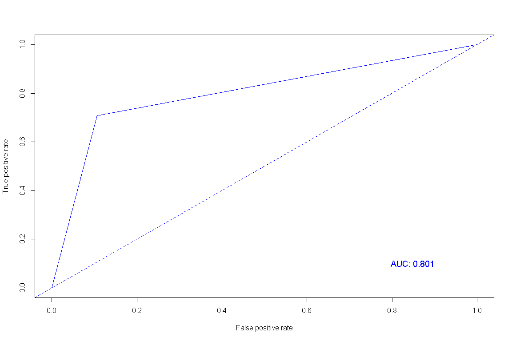

분류분석 - SVM
================

# Prerequisite

``` r
rm(list=ls())
# getwd()
# setwd("./R") # if necessary

viewSamples <- function(x,n=5) {
  x[sort(sample(1:nrow(x), n)),]
}
```

# 서포트 벡터 머신 (SVM)

`SVM`은 기계학습 분야 중 하나로 패턴인식, 자료분석 등을 위한 지도학습 모델이며 주로 회귀와 분류 문제 해결에 사용한다.

``` r
titanic <- read.csv("titanic.csv")

titanic$Age <- ifelse(is.na(titanic$Age), mean(titanic$Age, na.rm = T), titanic$Age)

titanic$Survived <- as.factor(titanic$Survived)
titanic$Sex <- as.factor(titanic$Sex)
titanic <- titanic[, -c(1,4,9,11,12)]

idx <- sample(1:nrow(titanic), nrow(titanic)*.7, replace = F)
titanic.train <- titanic[idx,]
titanic.test <- titanic[-idx,]
```

``` r
#install.packages("e1071")
library(e1071)

# 최적 파라미터값 찾기
titanic.tune <- tune.svm(Survived ~ ., data=titanic, gamma = 10^(-6:-1), cost = 10^(1:2))

# 모델링
titanic.svm <- svm(Survived ~., data = titanic.train, kernel = "radial",
                   gamma = titanic.tune$best.parameters$gamma,
                   cost = titanic.tune$best.parameters$cost)

summary(titanic.svm)
```

    ## 
    ## Call:
    ## svm(formula = Survived ~ ., data = titanic.train, kernel = "radial", gamma = titanic.tune$best.parameters$gamma, 
    ##     cost = titanic.tune$best.parameters$cost)
    ## 
    ## 
    ## Parameters:
    ##    SVM-Type:  C-classification 
    ##  SVM-Kernel:  radial 
    ##        cost:  10 
    ## 
    ## Number of Support Vectors:  273
    ## 
    ##  ( 131 142 )
    ## 
    ## 
    ## Number of Classes:  2 
    ## 
    ## Levels: 
    ##  0 1

``` r
titanic.svm.pred <- predict(titanic.svm, titanic.test, type = "class")

library(caret)
confusionMatrix(titanic.svm.pred, titanic.test[,1])
```

    ## Confusion Matrix and Statistics
    ## 
    ##           Reference
    ## Prediction   0   1
    ##          0 160  26
    ##          1  19  63
    ##                                           
    ##                Accuracy : 0.8321          
    ##                  95% CI : (0.7819, 0.8748)
    ##     No Information Rate : 0.6679          
    ##     P-Value [Acc > NIR] : 1.19e-09        
    ##                                           
    ##                   Kappa : 0.6139          
    ##                                           
    ##  Mcnemar's Test P-Value : 0.3711          
    ##                                           
    ##             Sensitivity : 0.8939          
    ##             Specificity : 0.7079          
    ##          Pos Pred Value : 0.8602          
    ##          Neg Pred Value : 0.7683          
    ##              Prevalence : 0.6679          
    ##          Detection Rate : 0.5970          
    ##    Detection Prevalence : 0.6940          
    ##       Balanced Accuracy : 0.8009          
    ##                                           
    ##        'Positive' Class : 0               
    ## 

``` r
library(ROCR)
titanic.svm.roc <- prediction(as.numeric(titanic.svm.pred), as.numeric(titanic.test[,1]))
plot(performance(titanic.svm.roc, "tpr", "fpr"), col="blue")
abline(a=0, b=1, lty=2, col="blue")
text(0.85, 0.1, paste("AUC:", round(as.numeric(performance(titanic.svm.roc, "auc")@y.values),3)), col="blue", cex = 1.2)
```

<!-- -->

-----

EOD
