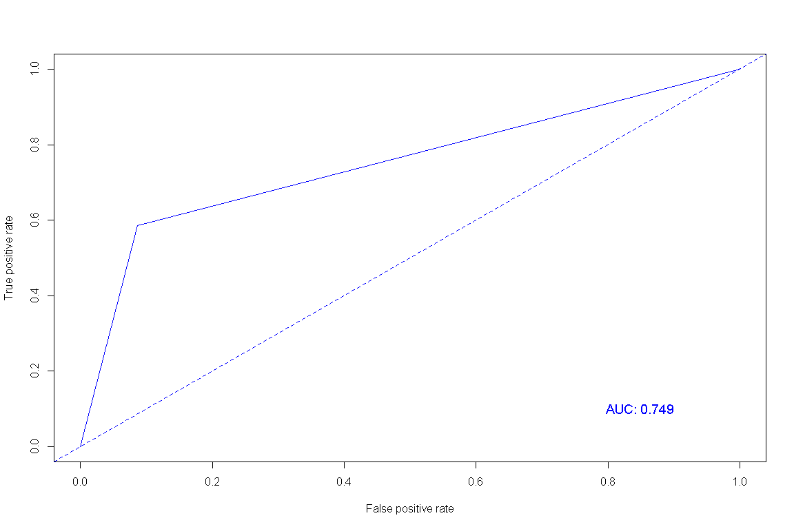

분류분석 - 나이브 베이즈 분류류
================

# Prerequisite

``` r
rm(list=ls())
# getwd()
# setwd("./R") # if necessary

viewSamples <- function(x,n=5) {
  x[sort(sample(1:nrow(x), n)),]
}
```

# 나이브 베이즈 분류 (Naive Bayes Classification)

`나이브 베이즈 분류`는 데이터에서 변수들에 대한 조건부 독립을 가정하는 알고리즘으로 클래스에 대한 사전 정보와 데이터로부터
추출된 정보를 결합하고 베이즈 정리를 이용하여 어떤 데이터가 특정 클래스에 속하는지를 분류하는 알고리즘이다.

``` r
titanic <- read.csv("titanic.csv")

titanic$Age <- ifelse(is.na(titanic$Age), mean(titanic$Age, na.rm = T), titanic$Age)

titanic$Survived <- as.factor(titanic$Survived)
titanic$Sex <- as.factor(titanic$Sex)
titanic <- titanic[, -c(1,4,9,11,12)]

idx <- sample(1:nrow(titanic), nrow(titanic)*.7, replace = F)
titanic.train <- titanic[idx,]
titanic.test <- titanic[-idx,]
```

``` r
library(e1071)

# 모델링
titanic.nb <- naiveBayes(Survived ~., data = titanic.train, laplace = 0)
titanic.nb
```

    ## 
    ## Naive Bayes Classifier for Discrete Predictors
    ## 
    ## Call:
    ## naiveBayes.default(x = X, y = Y, laplace = laplace)
    ## 
    ## A-priori probabilities:
    ## Y
    ##         0         1 
    ## 0.6404494 0.3595506 
    ## 
    ## Conditional probabilities:
    ##    Pclass
    ## Y       [,1]      [,2]
    ##   0 2.521303 0.7325335
    ##   1 1.950893 0.8794103
    ## 
    ##    Sex
    ## Y      female      male
    ##   0 0.1503759 0.8496241
    ##   1 0.6741071 0.3258929
    ## 
    ##    Age
    ## Y       [,1]     [,2]
    ##   0 30.89427 12.81215
    ##   1 28.92102 13.27757
    ## 
    ##    SibSp
    ## Y        [,1]      [,2]
    ##   0 0.5939850 1.3947367
    ##   1 0.5178571 0.7691605
    ## 
    ##    Parch
    ## Y        [,1]      [,2]
    ##   0 0.3233083 0.7946005
    ##   1 0.4642857 0.7858453
    ## 
    ##    Fare
    ## Y       [,1]     [,2]
    ##   0 22.30715 30.75604
    ##   1 51.91955 70.30427

``` r
titanic.nb.pred <- predict(titanic.nb, titanic.test, type = "class")

library(caret)
confusionMatrix(titanic.nb.pred, titanic.test[,1])
```

    ## Confusion Matrix and Statistics
    ## 
    ##           Reference
    ## Prediction   0   1
    ##          0 137  49
    ##          1  13  69
    ##                                           
    ##                Accuracy : 0.7687          
    ##                  95% CI : (0.7135, 0.8178)
    ##     No Information Rate : 0.5597          
    ##     P-Value [Acc > NIR] : 8.178e-13       
    ##                                           
    ##                   Kappa : 0.5148          
    ##                                           
    ##  Mcnemar's Test P-Value : 8.789e-06       
    ##                                           
    ##             Sensitivity : 0.9133          
    ##             Specificity : 0.5847          
    ##          Pos Pred Value : 0.7366          
    ##          Neg Pred Value : 0.8415          
    ##              Prevalence : 0.5597          
    ##          Detection Rate : 0.5112          
    ##    Detection Prevalence : 0.6940          
    ##       Balanced Accuracy : 0.7490          
    ##                                           
    ##        'Positive' Class : 0               
    ## 

``` r
library(ROCR)
titanic.nb.roc <- prediction(as.numeric(titanic.nb.pred), as.numeric(titanic.test[,1]))
plot(performance(titanic.nb.roc, "tpr", "fpr"), col="blue")
abline(a=0, b=1, lty=2, col="blue")
text(0.85, 0.1, paste("AUC:", round(as.numeric(performance(titanic.nb.roc, "auc")@y.values),3)), col="blue", cex = 1.2)
```

<!-- -->

-----

EOD
