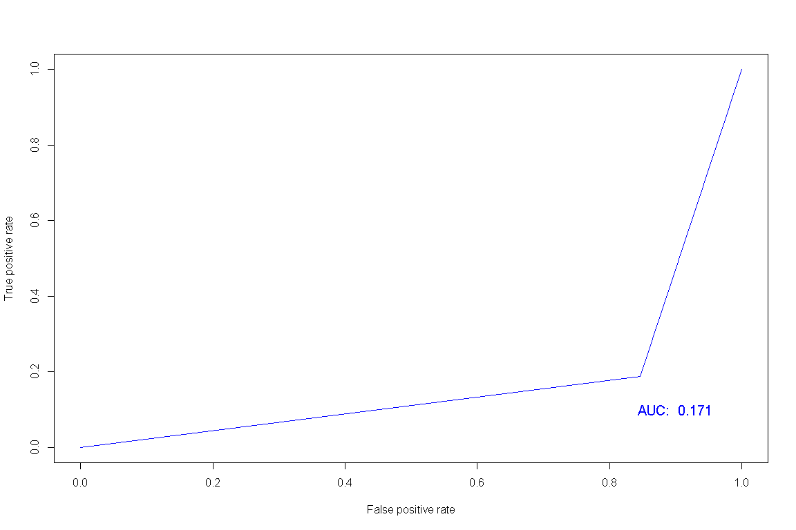
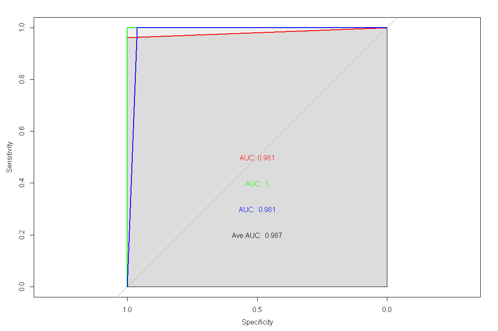

분류분석 - 로지스틱 회귀분석
================

# Prerequisite

``` r
rm(list=ls())
# getwd()
# setwd("./R") # if necessary

viewSamples <- function(x,n=5) {
  x[sort(sample(1:nrow(x), n)),]
}
```

# 로지스틱 회귀분석

`로지스틱 회귀분석`이란 반응변수가 범주형인 경우에 적용되는 회귀분석 모형이다.

## 단항 로지스틱 회귀분석

``` r
library(MASS)
data(VA)

str(VA)
```

    ## 'data.frame':    137 obs. of  8 variables:
    ##  $ stime    : num  72 411 228 126 118 10 82 110 314 100 ...
    ##  $ status   : num  1 1 1 1 1 1 1 1 1 0 ...
    ##  $ treat    : Factor w/ 2 levels "1","2": 1 1 1 1 1 1 1 1 1 1 ...
    ##  $ age      : num  69 64 38 63 65 49 69 68 43 70 ...
    ##  $ Karn     : num  60 70 60 60 70 20 40 80 50 70 ...
    ##  $ diag.time: num  7 5 3 9 11 5 10 29 18 6 ...
    ##  $ cell     : Factor w/ 4 levels "1","2","3","4": 1 1 1 1 1 1 1 1 1 1 ...
    ##  $ prior    : Factor w/ 2 levels "0","10": 1 2 1 2 2 1 2 1 1 1 ...

``` r
summary(VA)
```

    ##      stime           status       treat       age             Karn         diag.time      cell   prior  
    ##  Min.   :  1.0   Min.   :0.0000   1:69   Min.   :34.00   Min.   :10.00   Min.   : 1.000   1:35   0 :97  
    ##  1st Qu.: 25.0   1st Qu.:1.0000   2:68   1st Qu.:51.00   1st Qu.:40.00   1st Qu.: 3.000   2:48   10:40  
    ##  Median : 80.0   Median :1.0000          Median :62.00   Median :60.00   Median : 5.000   3:27          
    ##  Mean   :121.6   Mean   :0.9343          Mean   :58.31   Mean   :58.57   Mean   : 8.774   4:27          
    ##  3rd Qu.:144.0   3rd Qu.:1.0000          3rd Qu.:66.00   3rd Qu.:75.00   3rd Qu.:11.000                 
    ##  Max.   :999.0   Max.   :1.0000          Max.   :81.00   Max.   :99.00   Max.   :87.000

``` r
colSums(is.na(VA))
```

    ##     stime    status     treat       age      Karn diag.time      cell     prior 
    ##         0         0         0         0         0         0         0         0

``` r
viewSamples(VA)
```

    ##     stime status treat age Karn diag.time cell prior
    ## 11     42      1     1  81   60         4    1     0
    ## 12      8      1     1  63   40        58    1    10
    ## 35     52      1     1  55   70         2    2     0
    ## 37     18      1     1  60   30         4    2     0
    ## 134   111      1     2  64   60         5    4     0

``` r
idx <- sample(1:nrow(snails), nrow(snails)*0.7, replace = F)
snails.train <- snails[idx,]
snails.test <- snails[-idx,]
snails.glm <- glm(Species ~ ., snails.train, family = "binomial")
summary(snails.glm)
```

    ## 
    ## Call:
    ## glm(formula = Species ~ ., family = "binomial", data = snails.train)
    ## 
    ## Deviance Residuals: 
    ##      Min        1Q    Median        3Q       Max  
    ## -2.46152  -0.77467   0.09835   0.83773   1.96514  
    ## 
    ## Coefficients: (1 not defined because of singularities)
    ##             Estimate Std. Error z value Pr(>|z|)    
    ## (Intercept) -6.40170    3.75055  -1.707 0.087846 .  
    ## Exposure    -1.98579    0.58945  -3.369 0.000755 ***
    ## Rel.Hum      0.17522    0.06370   2.751 0.005949 ** 
    ## Temp        -0.19139    0.08795  -2.176 0.029552 *  
    ## Deaths       0.91797    0.26148   3.511 0.000447 ***
    ## N                 NA         NA      NA       NA    
    ## ---
    ## Signif. codes:  0 '***' 0.001 '**' 0.01 '*' 0.05 '.' 0.1 ' ' 1
    ## 
    ## (Dispersion parameter for binomial family taken to be 1)
    ## 
    ##     Null deviance: 92.747  on 66  degrees of freedom
    ## Residual deviance: 65.714  on 62  degrees of freedom
    ## AIC: 75.714
    ## 
    ## Number of Fisher Scoring iterations: 5

``` r
# 변수 선택법 적용
step(snails.glm, method = "backward")
```

    ## Start:  AIC=75.71
    ## Species ~ Exposure + Rel.Hum + Temp + Deaths + N
    ## 
    ## 
    ## Step:  AIC=75.71
    ## Species ~ Exposure + Rel.Hum + Temp + Deaths
    ## 
    ##            Df Deviance     AIC
    ## <none>          65.714  75.714
    ## - Temp      1   71.114  79.114
    ## - Rel.Hum   1   75.078  83.078
    ## - Exposure  1   82.647  90.647
    ## - Deaths    1   92.332 100.332

    ## 
    ## Call:  glm(formula = Species ~ Exposure + Rel.Hum + Temp + Deaths, family = "binomial", 
    ##     data = snails.train)
    ## 
    ## Coefficients:
    ## (Intercept)     Exposure      Rel.Hum         Temp       Deaths  
    ##     -6.4017      -1.9858       0.1752      -0.1914       0.9180  
    ## 
    ## Degrees of Freedom: 66 Total (i.e. Null);  62 Residual
    ## Null Deviance:       92.75 
    ## Residual Deviance: 65.71     AIC: 75.71

``` r
# 변수 선택법 적용
snails.glm <- glm(formula = Species ~ Exposure + Deaths, family = "binomial", data = snails.train)
summary(snails.glm)
```

    ## 
    ## Call:
    ## glm(formula = Species ~ Exposure + Deaths, family = "binomial", 
    ##     data = snails.train)
    ## 
    ## Deviance Residuals: 
    ##     Min       1Q   Median       3Q      Max  
    ## -1.5338  -0.8969   0.1987   1.0224   1.5257  
    ## 
    ## Coefficients:
    ##             Estimate Std. Error z value Pr(>|z|)   
    ## (Intercept)   1.4554     0.7757   1.876   0.0606 . 
    ## Exposure     -1.0791     0.4192  -2.574   0.0100 * 
    ## Deaths        0.5179     0.1739   2.978   0.0029 **
    ## ---
    ## Signif. codes:  0 '***' 0.001 '**' 0.01 '*' 0.05 '.' 0.1 ' ' 1
    ## 
    ## (Dispersion parameter for binomial family taken to be 1)
    ## 
    ##     Null deviance: 92.747  on 66  degrees of freedom
    ## Residual deviance: 77.494  on 64  degrees of freedom
    ## AIC: 83.494
    ## 
    ## Number of Fisher Scoring iterations: 5

``` r
snails.pred <- predict(snails.glm, snails.test, type = "response")
snails.pred <- ifelse(round(snails.pred) == 1, "A", "B")
mean(snails.pred == snails.test$Species)
```

    ## [1] 0.3103448

``` r
library(caret)
cM <- confusionMatrix(as.factor(snails.pred), as.factor(snails.test$Species))
cM
```

    ## Confusion Matrix and Statistics
    ## 
    ##           Reference
    ## Prediction  A  B
    ##          A  6 10
    ##          B 10  3
    ##                                           
    ##                Accuracy : 0.3103          
    ##                  95% CI : (0.1528, 0.5083)
    ##     No Information Rate : 0.5517          
    ##     P-Value [Acc > NIR] : 0.9975          
    ##                                           
    ##                   Kappa : -0.3942         
    ##                                           
    ##  Mcnemar's Test P-Value : 1.0000          
    ##                                           
    ##             Sensitivity : 0.3750          
    ##             Specificity : 0.2308          
    ##          Pos Pred Value : 0.3750          
    ##          Neg Pred Value : 0.2308          
    ##              Prevalence : 0.5517          
    ##          Detection Rate : 0.2069          
    ##    Detection Prevalence : 0.5517          
    ##       Balanced Accuracy : 0.3029          
    ##                                           
    ##        'Positive' Class : A               
    ## 

``` r
cM$byClass[c("Balanced Accuracy", "F1")]
```

    ## Balanced Accuracy                F1 
    ##         0.3028846         0.3750000

``` r
library(ROCR)
snails.roc <- prediction(as.numeric(as.factor(snails.pred)), as.numeric(as.factor(snails.test$Species)))
plot(performance(snails.roc, "tpr", "fpr"), col="blue")
text(0.9, 0.1, paste("AUC: ", round(as.numeric(performance(snails.roc, "auc")@y.values),3)), col="blue", cex = 1.25)
```

<!-- -->

## 다항 로지스틱 회귀분석

``` r
data(iris)
idx <- sample(1:nrow(iris), nrow(iris)*.6, replace = F)
iris.train <- iris[idx,]
iris.test <- iris[-idx,]
```

``` r
library(nnet)
iris.mlm <- multinom(Species ~ ., iris.train)
```

    ## # weights:  18 (10 variable)
    ## initial  value 98.875106 
    ## iter  10 value 13.264427
    ## iter  20 value 3.094132
    ## iter  30 value 2.870130
    ## iter  40 value 2.704871
    ## iter  50 value 2.580495
    ## iter  60 value 2.551908
    ## iter  70 value 2.500191
    ## iter  80 value 2.468673
    ## iter  90 value 2.392447
    ## iter 100 value 2.378332
    ## final  value 2.378332 
    ## stopped after 100 iterations

``` r
summary(iris.mlm)
```

    ## Call:
    ## multinom(formula = Species ~ ., data = iris.train)
    ## 
    ## Coefficients:
    ##            (Intercept) Sepal.Length Sepal.Width Petal.Length Petal.Width
    ## versicolor    39.58354    -1.027939   -20.63928     16.48789   -19.11263
    ## virginica    -51.60185    -4.708711   -36.53829     32.75113    27.25361
    ## 
    ## Std. Errors:
    ##            (Intercept) Sepal.Length Sepal.Width Petal.Length Petal.Width
    ## versicolor    75.76592     131.7158    186.7880     20.83070    102.0115
    ## virginica     81.38904     131.9326    187.4613     29.48298    104.5110
    ## 
    ## Residual Deviance: 4.756665 
    ## AIC: 24.75666

``` r
iris.pred <- predict(iris.mlm, iris.test[,-5])
confusionMatrix(iris.pred, iris.test[,5])
```

    ## Confusion Matrix and Statistics
    ## 
    ##             Reference
    ## Prediction   setosa versicolor virginica
    ##   setosa         17          0         0
    ##   versicolor      1         24         1
    ##   virginica       0          0        17
    ## 
    ## Overall Statistics
    ##                                           
    ##                Accuracy : 0.9667          
    ##                  95% CI : (0.8847, 0.9959)
    ##     No Information Rate : 0.4             
    ##     P-Value [Acc > NIR] : < 2.2e-16       
    ##                                           
    ##                   Kappa : 0.9492          
    ##                                           
    ##  Mcnemar's Test P-Value : NA              
    ## 
    ## Statistics by Class:
    ## 
    ##                      Class: setosa Class: versicolor Class: virginica
    ## Sensitivity                 0.9444            1.0000           0.9444
    ## Specificity                 1.0000            0.9444           1.0000
    ## Pos Pred Value              1.0000            0.9231           1.0000
    ## Neg Pred Value              0.9767            1.0000           0.9767
    ## Prevalence                  0.3000            0.4000           0.3000
    ## Detection Rate              0.2833            0.4000           0.2833
    ## Detection Prevalence        0.2833            0.4333           0.2833
    ## Balanced Accuracy           0.9722            0.9722           0.9722

``` r
library(pROC)
iris.roc <- multiclass.roc(as.numeric(iris.pred), as.numeric(iris.test[,5]))
# par(mfrow = c(1,3))
# plot.roc(iris.roc$rocs[[1]], col = "red", print.auc = T, max.auc.polygon=TRUE, auc.polygon=TRUE)
# plot.roc(iris.roc$rocs[[2]], col = "green", print.auc = T, max.auc.polygon=TRUE, auc.polygon=TRUE)
# plot.roc(iris.roc$rocs[[3]], col = "blue", print.auc = T, max.auc.polygon=TRUE, auc.polygon=TRUE)
plot.roc(iris.roc$rocs[[1]], col = "red", print.auc = T, print.auc.adj=c(0.5, 0.5), max.auc.polygon=TRUE, auc.polygon=TRUE)
lines.roc(iris.roc$rocs[[2]], col="green")
text(0.5, 0.4, paste("AUC: ", round(auc(iris.roc$rocs[[2]]),3)), col = "green" )
lines.roc(iris.roc$rocs[[3]], col="blue")
text(0.5, 0.3, paste("AUC: ", round(auc(iris.roc$rocs[[3]]),3)), col = "blue" )
text(0.5, 0.2, paste("Ave.AUC: ", round(iris.roc$auc,3)), col = "black" )
```

<!-- -->

-----

EOD
