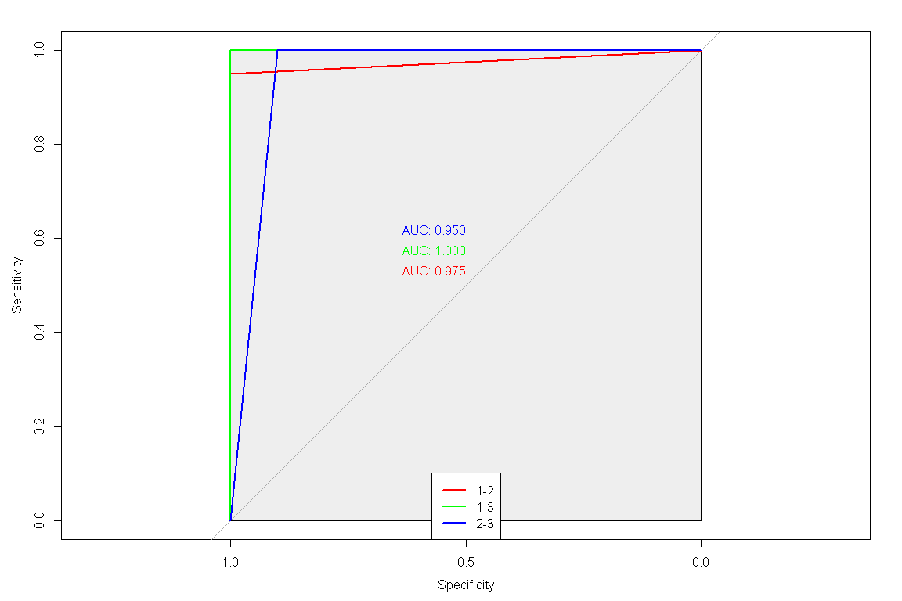

분류분석 - 로지스틱 회귀분석
================

# Prerequisite

``` r
rm(list=ls())
# getwd()
# setwd("./R") # if necessary

viewSamples <- function(x,n=5) {
  x[sort(sample(1:nrow(x), n)),]
}
```

# 로지스틱 회귀분석

`로지스틱 회귀분석`이란 반응변수가 범주형인 경우에 적용되는 회귀분석 모형이다.

## 단항 로지스틱 회귀분석

``` r
library(MASS)
data(VA)

str(VA)
```

    ## 'data.frame':    137 obs. of  8 variables:
    ##  $ stime    : num  72 411 228 126 118 10 82 110 314 100 ...
    ##  $ status   : num  1 1 1 1 1 1 1 1 1 0 ...
    ##  $ treat    : Factor w/ 2 levels "1","2": 1 1 1 1 1 1 1 1 1 1 ...
    ##  $ age      : num  69 64 38 63 65 49 69 68 43 70 ...
    ##  $ Karn     : num  60 70 60 60 70 20 40 80 50 70 ...
    ##  $ diag.time: num  7 5 3 9 11 5 10 29 18 6 ...
    ##  $ cell     : Factor w/ 4 levels "1","2","3","4": 1 1 1 1 1 1 1 1 1 1 ...
    ##  $ prior    : Factor w/ 2 levels "0","10": 1 2 1 2 2 1 2 1 1 1 ...

``` r
summary(VA)
```

    ##      stime           status       treat       age             Karn         diag.time      cell   prior  
    ##  Min.   :  1.0   Min.   :0.0000   1:69   Min.   :34.00   Min.   :10.00   Min.   : 1.000   1:35   0 :97  
    ##  1st Qu.: 25.0   1st Qu.:1.0000   2:68   1st Qu.:51.00   1st Qu.:40.00   1st Qu.: 3.000   2:48   10:40  
    ##  Median : 80.0   Median :1.0000          Median :62.00   Median :60.00   Median : 5.000   3:27          
    ##  Mean   :121.6   Mean   :0.9343          Mean   :58.31   Mean   :58.57   Mean   : 8.774   4:27          
    ##  3rd Qu.:144.0   3rd Qu.:1.0000          3rd Qu.:66.00   3rd Qu.:75.00   3rd Qu.:11.000                 
    ##  Max.   :999.0   Max.   :1.0000          Max.   :81.00   Max.   :99.00   Max.   :87.000

``` r
colSums(is.na(VA))
```

    ##     stime    status     treat       age      Karn diag.time      cell     prior 
    ##         0         0         0         0         0         0         0         0

``` r
viewSamples(VA)
```

    ##     stime status treat age Karn diag.time cell prior
    ## 7      82      1     1  69   40        10    1    10
    ## 43     63      1     1  48   50        11    2     0
    ## 71    112      1     2  60   80         6    1     0
    ## 119     7      1     2  58   40         4    3     0
    ## 135   231      1     2  67   70        18    4    10

``` r
idx <- sample(1:nrow(snails), nrow(snails)*0.7, replace = F)
snails.train <- snails[idx,]
snails.test <- snails[-idx,]
snails.glm <- glm(Species ~ ., snails.train, family = "binomial")
summary(snails.glm)
```

    ## 
    ## Call:
    ## glm(formula = Species ~ ., family = "binomial", data = snails.train)
    ## 
    ## Deviance Residuals: 
    ##     Min       1Q   Median       3Q      Max  
    ## -1.9684  -0.8787  -0.3476   0.9610   1.8659  
    ## 
    ## Coefficients: (1 not defined because of singularities)
    ##             Estimate Std. Error z value Pr(>|z|)   
    ## (Intercept) -7.00777    3.68361  -1.902  0.05712 . 
    ## Exposure    -1.53089    0.52279  -2.928  0.00341 **
    ## Rel.Hum      0.14962    0.05693   2.628  0.00859 **
    ## Temp        -0.10208    0.07320  -1.394  0.16318   
    ## Deaths       0.79294    0.24582   3.226  0.00126 **
    ## N                 NA         NA      NA       NA   
    ## ---
    ## Signif. codes:  0 '***' 0.001 '**' 0.01 '*' 0.05 '.' 0.1 ' ' 1
    ## 
    ## (Dispersion parameter for binomial family taken to be 1)
    ## 
    ##     Null deviance: 92.747  on 66  degrees of freedom
    ## Residual deviance: 72.182  on 62  degrees of freedom
    ## AIC: 82.182
    ## 
    ## Number of Fisher Scoring iterations: 5

``` r
# 변수 선택법 적용
step(snails.glm, method = "backward")
```

    ## Start:  AIC=82.18
    ## Species ~ Exposure + Rel.Hum + Temp + Deaths + N
    ## 
    ## 
    ## Step:  AIC=82.18
    ## Species ~ Exposure + Rel.Hum + Temp + Deaths
    ## 
    ##            Df Deviance    AIC
    ## <none>          72.182 82.182
    ## - Temp      1   74.217 82.217
    ## - Rel.Hum   1   80.321 88.321
    ## - Exposure  1   83.584 91.584
    ## - Deaths    1   91.319 99.319

    ## 
    ## Call:  glm(formula = Species ~ Exposure + Rel.Hum + Temp + Deaths, family = "binomial", 
    ##     data = snails.train)
    ## 
    ## Coefficients:
    ## (Intercept)     Exposure      Rel.Hum         Temp       Deaths  
    ##     -7.0078      -1.5309       0.1496      -0.1021       0.7929  
    ## 
    ## Degrees of Freedom: 66 Total (i.e. Null);  62 Residual
    ## Null Deviance:       92.75 
    ## Residual Deviance: 72.18     AIC: 82.18

``` r
# 변수 선택법 적용
snails.glm <- glm(formula = Species ~ Exposure + Deaths, family = "binomial", data = snails.train)
summary(snails.glm)
```

    ## 
    ## Call:
    ## glm(formula = Species ~ Exposure + Deaths, family = "binomial", 
    ##     data = snails.train)
    ## 
    ## Deviance Residuals: 
    ##     Min       1Q   Median       3Q      Max  
    ## -1.4969  -1.1265  -0.5609   1.1516   1.5550  
    ## 
    ## Coefficients:
    ##             Estimate Std. Error z value Pr(>|z|)   
    ## (Intercept)   0.9764     0.7380   1.323  0.18583   
    ## Exposure     -0.9154     0.4136  -2.213  0.02688 * 
    ## Deaths        0.4873     0.1802   2.704  0.00684 **
    ## ---
    ## Signif. codes:  0 '***' 0.001 '**' 0.01 '*' 0.05 '.' 0.1 ' ' 1
    ## 
    ## (Dispersion parameter for binomial family taken to be 1)
    ## 
    ##     Null deviance: 92.747  on 66  degrees of freedom
    ## Residual deviance: 81.354  on 64  degrees of freedom
    ## AIC: 87.354
    ## 
    ## Number of Fisher Scoring iterations: 4

``` r
snails.pred <- predict(snails.glm, snails.test, type = "response")
snails.pred <- ifelse(round(snails.pred) == 1, "A", "B")
mean(snails.pred == snails.test$Species)
```

    ## [1] 0.1724138

``` r
library(caret)
cM <- confusionMatrix(as.factor(snails.pred), as.factor(snails.test$Species))
cM
```

    ## Confusion Matrix and Statistics
    ## 
    ##           Reference
    ## Prediction  A  B
    ##          A  2 13
    ##          B 11  3
    ##                                           
    ##                Accuracy : 0.1724          
    ##                  95% CI : (0.0585, 0.3577)
    ##     No Information Rate : 0.5517          
    ##     P-Value [Acc > NIR] : 1.0000          
    ##                                           
    ##                   Kappa : -0.6493         
    ##                                           
    ##  Mcnemar's Test P-Value : 0.8383          
    ##                                           
    ##             Sensitivity : 0.15385         
    ##             Specificity : 0.18750         
    ##          Pos Pred Value : 0.13333         
    ##          Neg Pred Value : 0.21429         
    ##              Prevalence : 0.44828         
    ##          Detection Rate : 0.06897         
    ##    Detection Prevalence : 0.51724         
    ##       Balanced Accuracy : 0.17067         
    ##                                           
    ##        'Positive' Class : A               
    ## 

``` r
cM$byClass[c("Balanced Accuracy", "F1")]
```

    ## Balanced Accuracy                F1 
    ##         0.1706731         0.1428571

``` r
library(ROCR)
snails.roc <- prediction(as.numeric(as.factor(snails.pred)), as.numeric(as.factor(snails.test$Species)))
plot(performance(snails.roc, "tpr", "fpr"), col="blue")
text(0.9, 0.1, paste("AUC: ", round(as.numeric(performance(snails.roc, "auc")@y.values),3)), col="blue", cex = 1.25)
```

<!-- -->

## 다항 로지스틱 회귀분석

``` r
data(iris)
idx <- sample(1:nrow(iris), nrow(iris)*.6, replace = F)
iris.train <- iris[idx,]
iris.test <- iris[-idx,]
```

``` r
library(nnet)
iris.mlm <- multinom(Species ~ ., iris.train)
```

    ## # weights:  18 (10 variable)
    ## initial  value 98.875106 
    ## iter  10 value 8.174787
    ## iter  20 value 4.612951
    ## iter  30 value 4.525776
    ## iter  40 value 4.524699
    ## iter  50 value 4.523773
    ## iter  60 value 4.523484
    ## iter  70 value 4.523262
    ## iter  80 value 4.523142
    ## final  value 4.523066 
    ## converged

``` r
summary(iris.mlm)
```

    ## Call:
    ## multinom(formula = Species ~ ., data = iris.train)
    ## 
    ## Coefficients:
    ##            (Intercept) Sepal.Length Sepal.Width Petal.Length Petal.Width
    ## versicolor    31.51012     1.088692   -20.26317     9.012152   -3.078942
    ## virginica    -25.84875     0.792315   -26.92887    19.577195   12.170638
    ## 
    ## Std. Errors:
    ##            (Intercept) Sepal.Length Sepal.Width Petal.Length Petal.Width
    ## versicolor    29.85248     222.3947    306.6516     94.73794    57.80433
    ## virginica     31.63491     222.3943    306.7218     95.00939    58.18017
    ## 
    ## Residual Deviance: 9.046132 
    ## AIC: 29.04613

``` r
iris.pred <- predict(iris.mlm, iris.test[,-5])
confusionMatrix(iris.pred, iris.test[,5])
```

    ## Confusion Matrix and Statistics
    ## 
    ##             Reference
    ## Prediction   setosa versicolor virginica
    ##   setosa         19          0         0
    ##   versicolor      1         17         2
    ##   virginica       0          0        21
    ## 
    ## Overall Statistics
    ##                                           
    ##                Accuracy : 0.95            
    ##                  95% CI : (0.8608, 0.9896)
    ##     No Information Rate : 0.3833          
    ##     P-Value [Acc > NIR] : < 2.2e-16       
    ##                                           
    ##                   Kappa : 0.9249          
    ##                                           
    ##  Mcnemar's Test P-Value : NA              
    ## 
    ## Statistics by Class:
    ## 
    ##                      Class: setosa Class: versicolor Class: virginica
    ## Sensitivity                 0.9500            1.0000           0.9130
    ## Specificity                 1.0000            0.9302           1.0000
    ## Pos Pred Value              1.0000            0.8500           1.0000
    ## Neg Pred Value              0.9756            1.0000           0.9487
    ## Prevalence                  0.3333            0.2833           0.3833
    ## Detection Rate              0.3167            0.2833           0.3500
    ## Detection Prevalence        0.3167            0.3333           0.3500
    ## Balanced Accuracy           0.9750            0.9651           0.9565

``` r
library(pROC)
iris.roc <- multiclass.roc(as.numeric(iris.pred), as.numeric(iris.test[,5]))
# par(mfrow = c(1,3))
plot.roc(iris.roc$rocs[[1]], col = "red", print.auc = T, print.auc.adj=c(1, -1), max.auc.polygon=TRUE)
plot.roc(iris.roc$rocs[[2]], col = "green", print.auc = T, print.auc.adj=c(1, -3), add = T)
plot.roc(iris.roc$rocs[[3]], col = "blue", print.auc = T, print.auc.adj=c(1, -5), add = T)
legend("bottom", legend = c("1-2", "1-3", "2-3"), col = c("red", "green", "blue"), lwd=2)
```

<!-- -->

``` r
# plot.roc(iris.roc$rocs[[1]], col = "red", print.auc = T, print.auc.adj=c(0.5, 0.5), max.auc.polygon=TRUE, auc.polygon=TRUE)
# lines.roc(iris.roc$rocs[[2]], col="green")
# text(0.5, 0.4, paste("AUC: ", round(auc(iris.roc$rocs[[2]]),3)), col = "green" )
# lines.roc(iris.roc$rocs[[3]], col="blue")
# text(0.5, 0.3, paste("AUC: ", round(auc(iris.roc$rocs[[3]]),3)), col = "blue" )
# text(0.5, 0.2, paste("Ave.AUC: ", round(iris.roc$auc,3)), col = "black" )
```

-----

EOD
