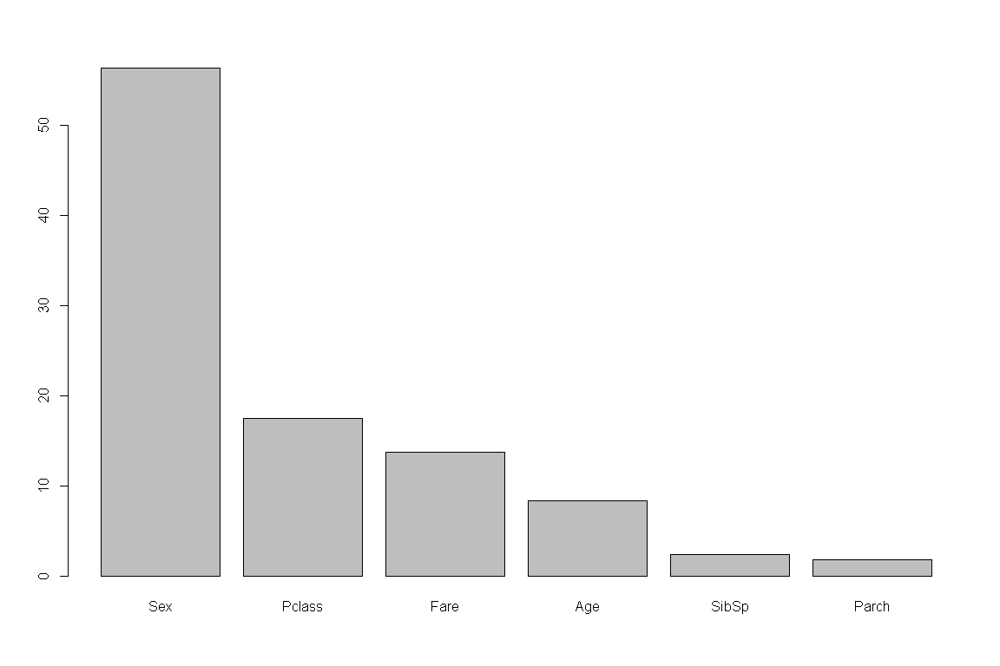

분류분석 - 앙상블(Ensemble)
================

# Prerequisite

``` r
rm(list=ls())
# getwd()
# setwd("./R") # if necessary

viewSamples <- function(x,n=5) {
  x[sort(sample(1:nrow(x), n)),]
}
```

# 앙상블(Ensemble)

`앙상블 기법`은 주어진 자료로부터 여러 개의 예측 모형들을 만든 후 예측모형들을 조합하여 하나의 최종 예측모형을 만드는
방법이다.

\[ 사용할 데이터: titanic\]

``` r
titanic <- read.csv("titanic.csv")
```

``` r
str(titanic)
```

    ## 'data.frame':    891 obs. of  12 variables:
    ##  $ PassengerId: int  1 2 3 4 5 6 7 8 9 10 ...
    ##  $ Survived   : int  0 1 1 1 0 0 0 0 1 1 ...
    ##  $ Pclass     : int  3 1 3 1 3 3 1 3 3 2 ...
    ##  $ Name       : chr  "Braund, Mr. Owen Harris" "Cumings, Mrs. John Bradley (Florence Briggs Thayer)" "Heikkinen, Miss. Laina" "Futrelle, Mrs. Jacques Heath (Lily May Peel)" ...
    ##  $ Sex        : chr  "male" "female" "female" "female" ...
    ##  $ Age        : num  22 38 26 35 35 NA 54 2 27 14 ...
    ##  $ SibSp      : int  1 1 0 1 0 0 0 3 0 1 ...
    ##  $ Parch      : int  0 0 0 0 0 0 0 1 2 0 ...
    ##  $ Ticket     : chr  "A/5 21171" "PC 17599" "STON/O2. 3101282" "113803" ...
    ##  $ Fare       : num  7.25 71.28 7.92 53.1 8.05 ...
    ##  $ Cabin      : chr  "" "C85" "" "C123" ...
    ##  $ Embarked   : chr  "S" "C" "S" "S" ...

``` r
summary(titanic)
```

    ##   PassengerId       Survived          Pclass          Name               Sex                 Age            SibSp      
    ##  Min.   :  1.0   Min.   :0.0000   Min.   :1.000   Length:891         Length:891         Min.   : 0.42   Min.   :0.000  
    ##  1st Qu.:223.5   1st Qu.:0.0000   1st Qu.:2.000   Class :character   Class :character   1st Qu.:20.12   1st Qu.:0.000  
    ##  Median :446.0   Median :0.0000   Median :3.000   Mode  :character   Mode  :character   Median :28.00   Median :0.000  
    ##  Mean   :446.0   Mean   :0.3838   Mean   :2.309                                         Mean   :29.70   Mean   :0.523  
    ##  3rd Qu.:668.5   3rd Qu.:1.0000   3rd Qu.:3.000                                         3rd Qu.:38.00   3rd Qu.:1.000  
    ##  Max.   :891.0   Max.   :1.0000   Max.   :3.000                                         Max.   :80.00   Max.   :8.000  
    ##                                                                                         NA's   :177                    
    ##      Parch           Ticket               Fare           Cabin             Embarked        
    ##  Min.   :0.0000   Length:891         Min.   :  0.00   Length:891         Length:891        
    ##  1st Qu.:0.0000   Class :character   1st Qu.:  7.91   Class :character   Class :character  
    ##  Median :0.0000   Mode  :character   Median : 14.45   Mode  :character   Mode  :character  
    ##  Mean   :0.3816                      Mean   : 32.20                                        
    ##  3rd Qu.:0.0000                      3rd Qu.: 31.00                                        
    ##  Max.   :6.0000                      Max.   :512.33                                        
    ## 

``` r
viewSamples(titanic)
```

    ##     PassengerId Survived Pclass                            Name  Sex  Age SibSp Parch       Ticket    Fare Cabin
    ## 154         154        0      3 van Billiard, Mr. Austin Blyler male 40.5     0     2     A/5. 851 14.5000      
    ## 175         175        0      1         Smith, Mr. James Clinch male 56.0     0     0        17764 30.6958    A7
    ## 553         553        0      3            O'Brien, Mr. Timothy male   NA     0     0       330979  7.8292      
    ## 666         666        0      2              Hickman, Mr. Lewis male 32.0     2     0 S.O.C. 14879 73.5000      
    ## 715         715        0      2           Greenberg, Mr. Samuel male 52.0     0     0       250647 13.0000      
    ##     Embarked
    ## 154        S
    ## 175        C
    ## 553        Q
    ## 666        S
    ## 715        S

``` r
colSums(is.na(titanic))
```

    ## PassengerId    Survived      Pclass        Name         Sex         Age       SibSp       Parch      Ticket        Fare 
    ##           0           0           0           0           0         177           0           0           0           0 
    ##       Cabin    Embarked 
    ##           0           0

``` r
titanic$Age <- ifelse(is.na(titanic$Age), mean(titanic$Age, na.rm = T), titanic$Age)
colSums(is.na(titanic))
```

    ## PassengerId    Survived      Pclass        Name         Sex         Age       SibSp       Parch      Ticket        Fare 
    ##           0           0           0           0           0           0           0           0           0           0 
    ##       Cabin    Embarked 
    ##           0           0

``` r
titanic$Survived <- as.factor(titanic$Survived)
titanic$Sex <- as.factor(titanic$Sex)
titanic <- titanic[, -c(1,4,9,11,12)]
str(titanic)
```

    ## 'data.frame':    891 obs. of  7 variables:
    ##  $ Survived: Factor w/ 2 levels "0","1": 1 2 2 2 1 1 1 1 2 2 ...
    ##  $ Pclass  : int  3 1 3 1 3 3 1 3 3 2 ...
    ##  $ Sex     : Factor w/ 2 levels "female","male": 2 1 1 1 2 2 2 2 1 1 ...
    ##  $ Age     : num  22 38 26 35 35 ...
    ##  $ SibSp   : int  1 1 0 1 0 0 0 3 0 1 ...
    ##  $ Parch   : int  0 0 0 0 0 0 0 1 2 0 ...
    ##  $ Fare    : num  7.25 71.28 7.92 53.1 8.05 ...

``` r
idx <- sample(1:nrow(titanic), nrow(titanic)*.7, replace = F)
titanic.train <- titanic[idx,]
titanic.test <- titanic[-idx,]
```

## 배깅(Bagging)

``` r
#install.packages("adabag")
library(adabag)
titanic.bg <- bagging(Survived ~ ., titanic.train, mfinal=10)
names(titanic.bg)
```

    ## [1] "formula"    "trees"      "votes"      "prob"       "class"      "samples"    "importance" "terms"      "call"

``` r
barplot(sort(titanic.bg$importance, decreasing = T))
```

<!-- -->

``` r
titanic.bg.pred <- predict(titanic.bg, titanic.test, type = "class")
titanic.bg.pred$class <- as.factor(titanic.bg.pred$class)
library(caret)
confusionMatrix(titanic.bg.pred$class, titanic.test[,1])
```

    ## Confusion Matrix and Statistics
    ## 
    ##           Reference
    ## Prediction   0   1
    ##          0 147  38
    ##          1  19  64
    ##                                           
    ##                Accuracy : 0.7873          
    ##                  95% CI : (0.7334, 0.8347)
    ##     No Information Rate : 0.6194          
    ##     P-Value [Acc > NIR] : 2.775e-09       
    ##                                           
    ##                   Kappa : 0.5321          
    ##                                           
    ##  Mcnemar's Test P-Value : 0.01712         
    ##                                           
    ##             Sensitivity : 0.8855          
    ##             Specificity : 0.6275          
    ##          Pos Pred Value : 0.7946          
    ##          Neg Pred Value : 0.7711          
    ##              Prevalence : 0.6194          
    ##          Detection Rate : 0.5485          
    ##    Detection Prevalence : 0.6903          
    ##       Balanced Accuracy : 0.7565          
    ##                                           
    ##        'Positive' Class : 0               
    ## 

``` r
library(ROCR)
titanic.bg.roc <- prediction(as.integer(titanic.bg.pred$class), as.integer(titanic.test[,1]))
plot(performance(titanic.bg.roc, "tpr", "fpr"), col="blue")
abline(a=0, b=1, lty=2, col="blue")
text(0.85, 0.1, paste("AUC:", round(as.numeric(performance(titanic.bg.roc, "auc")@y.values),3)), col="blue", cex = 1.2)
```

<!-- -->

## 부스팅(Boosting)

``` r
titanic.bt <- boosting(Survived ~ ., titanic.train, boos = T, mfinal=10)
titanic.bt.pred <- predict(titanic.bt, titanic.test, type = "class")
titanic.bt.pred$class <- as.factor(titanic.bt.pred$class)

confusionMatrix(titanic.bt.pred$class, titanic.test[,1])
```

    ## Confusion Matrix and Statistics
    ## 
    ##           Reference
    ## Prediction   0   1
    ##          0 140  27
    ##          1  26  75
    ##                                           
    ##                Accuracy : 0.8022          
    ##                  95% CI : (0.7494, 0.8482)
    ##     No Information Rate : 0.6194          
    ##     P-Value [Acc > NIR] : 8.34e-11        
    ##                                           
    ##                   Kappa : 0.5798          
    ##                                           
    ##  Mcnemar's Test P-Value : 1               
    ##                                           
    ##             Sensitivity : 0.8434          
    ##             Specificity : 0.7353          
    ##          Pos Pred Value : 0.8383          
    ##          Neg Pred Value : 0.7426          
    ##              Prevalence : 0.6194          
    ##          Detection Rate : 0.5224          
    ##    Detection Prevalence : 0.6231          
    ##       Balanced Accuracy : 0.7893          
    ##                                           
    ##        'Positive' Class : 0               
    ## 

``` r
titanic.bt.roc <- prediction(as.integer(titanic.bt.pred$class), as.integer(titanic.test[,1]))
plot(performance(titanic.bt.roc, "tpr", "fpr"), col="blue")
abline(a=0, b=1, lty=2, col="blue")
text(0.85, 0.1, paste("AUC:", round(as.numeric(performance(titanic.bt.roc, "auc")@y.values),3)), col="blue", cex = 1.2)
```

<!-- -->

## 랜덤포레스트(Random Forest)

``` r
#install.packages("randomForest")
library(randomForest)

titanic.rf <- randomForest(Survived ~ ., titanic.train, ntree=10, mtry=sqrt(20), importance = T)
titanic.rf.pred <- predict(titanic.rf, titanic.test, type = "class")
titanic.rf.pred <- as.factor(titanic.rf.pred)
confusionMatrix(titanic.rf.pred, titanic.test[,1])
```

    ## Confusion Matrix and Statistics
    ## 
    ##           Reference
    ## Prediction   0   1
    ##          0 144  30
    ##          1  22  72
    ##                                           
    ##                Accuracy : 0.806           
    ##                  95% CI : (0.7535, 0.8516)
    ##     No Information Rate : 0.6194          
    ##     P-Value [Acc > NIR] : 3.281e-11       
    ##                                           
    ##                   Kappa : 0.5822          
    ##                                           
    ##  Mcnemar's Test P-Value : 0.3317          
    ##                                           
    ##             Sensitivity : 0.8675          
    ##             Specificity : 0.7059          
    ##          Pos Pred Value : 0.8276          
    ##          Neg Pred Value : 0.7660          
    ##              Prevalence : 0.6194          
    ##          Detection Rate : 0.5373          
    ##    Detection Prevalence : 0.6493          
    ##       Balanced Accuracy : 0.7867          
    ##                                           
    ##        'Positive' Class : 0               
    ## 

``` r
varImpPlot(titanic.rf)
```

<!-- -->

``` r
titanic.rf.roc <- prediction(as.numeric(titanic.rf.pred), as.integer(titanic.test[,1]))
plot(performance(titanic.rf.roc, "tpr", "fpr"), col="blue")
abline(a=0, b=1, lty=2, col="blue")
text(0.85, 0.1, paste("AUC:", round(as.numeric(performance(titanic.rf.roc, "auc")@y.values),3)), col="blue", cex = 1.2)
```

<!-- -->

-----

EOD
