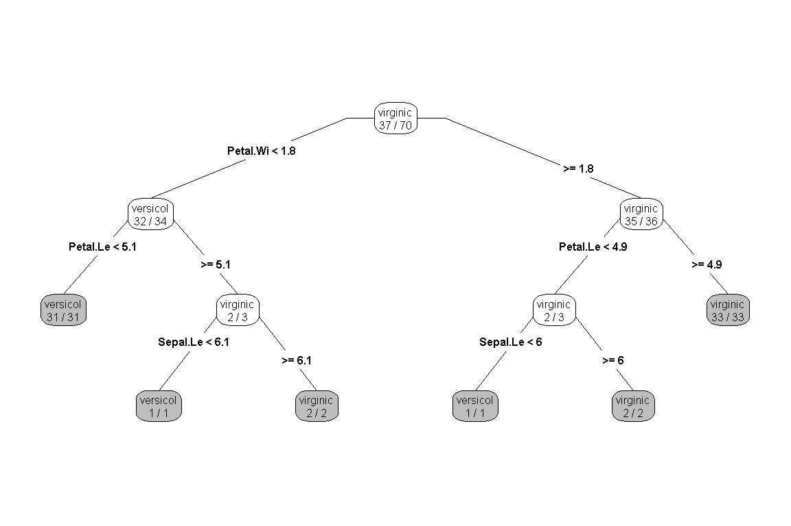
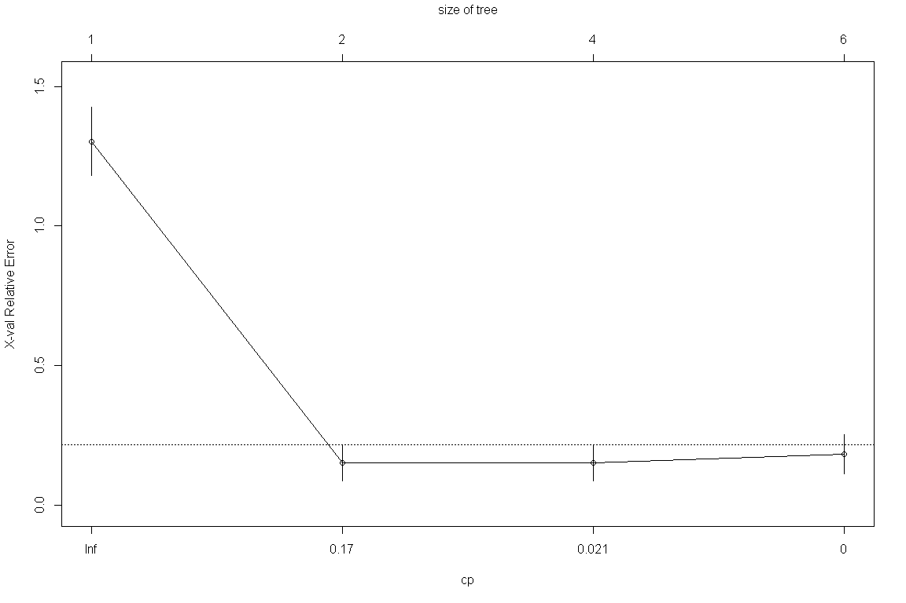
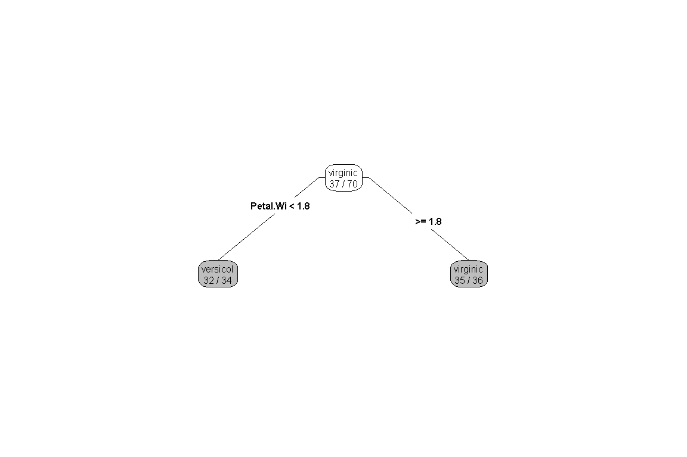

분류분석 - 의사결정나무
================

# Prerequisite

``` r
rm(list=ls())
# getwd()
# setwd("./R") # if necessary

viewSamples <- function(x,n=5) {
  x[sort(sample(1:nrow(x), n)),]
}
```

# 의사결정나무

`의사결정나무`는 분류함수를 의사결정 규칙으로 이루어진 나무 모양으로 그리는 방법이다.

``` r
iris <- subset(iris, Species == 'virginica' | Species == 'versicolor')
idx <- sample(1:nrow(iris), nrow(iris)*0.7, replace = F)
iris.train <- iris[idx,]
iris.test <- iris[-idx,]

library(rpart)
library(rpart.plot)
# 최소 제약으로 모델 생성
iris.dt <- rpart(Species~., data = iris.train, cp = 0, minsplit = 1)
prp(iris.dt, type=4, extra = 2, box.col = ifelse(iris.dt$frame$var =="<leaf>", 'gray', 'white'))
```

<!-- -->

``` r
iris.dt$cptable
```

    ##           CP nsplit  rel error    xerror       xstd
    ## 1 0.90909091      0 1.00000000 1.3030303 0.12341079
    ## 2 0.03030303      1 0.09090909 0.1515152 0.06529482
    ## 3 0.01515152      3 0.03030303 0.1515152 0.06529482
    ## 4 0.00000000      5 0.00000000 0.1818182 0.07097455

``` r
plotcp(iris.dt)
```

<!-- -->

``` r
opt <- which.min(iris.dt$cptable[,"xerror"])
cp <- iris.dt$cptable[opt, "CP"]
prune.dt <- prune(iris.dt, cp = cp)
prp(prune.dt, type=4, extra = 2, box.col = ifelse(prune.dt$frame$var =="<leaf>", 'gray', 'white'))
```

<!-- -->

-----

EOD
