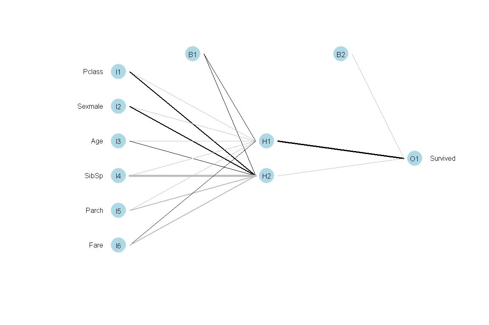
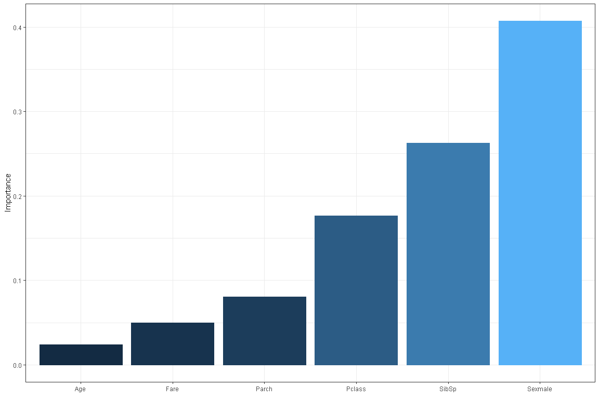
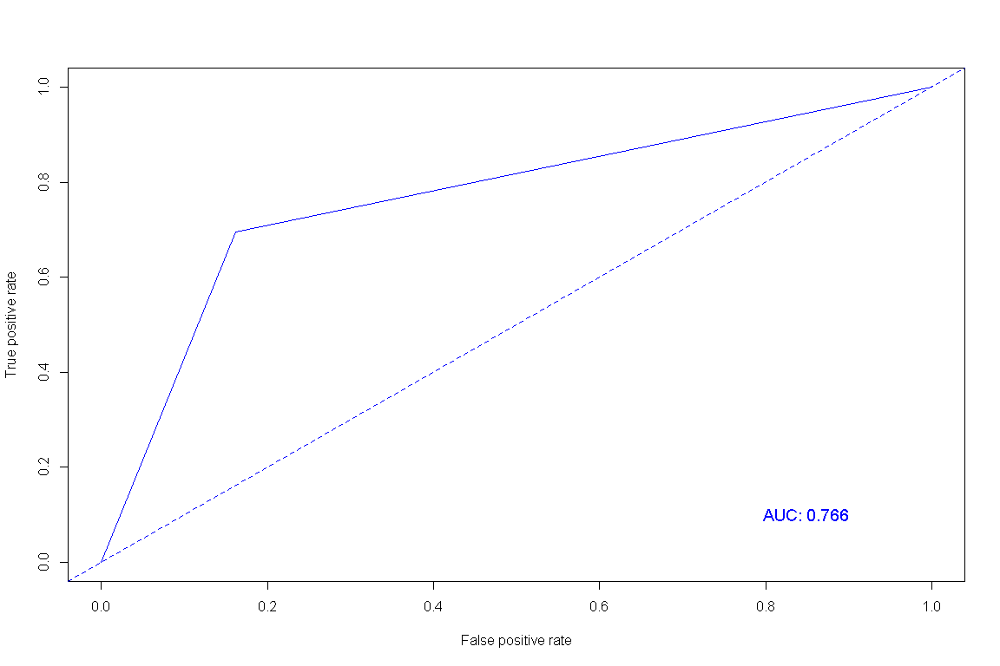

분류분석 - 인공신경망
================

# Prerequisite

``` r
rm(list=ls())
# getwd()
# setwd("./R") # if necessary

viewSamples <- function(x,n=5) {
  x[sort(sample(1:nrow(x), n)),]
}
```

# 인공신경망 모형(Artificial Neural Network)

`인공신경망`은 동물의 뇌신경계를 모방하여 분류 또는 예측하기 위해 만들어진 모형이다.

``` r
titanic <- read.csv("titanic.csv")

titanic$Age <- ifelse(is.na(titanic$Age), mean(titanic$Age, na.rm = T), titanic$Age)

titanic$Survived <- as.factor(titanic$Survived)
titanic$Sex <- as.factor(titanic$Sex)
titanic <- titanic[, -c(1,4,9,11,12)]

idx <- sample(1:nrow(titanic), nrow(titanic)*.7, replace = F)
titanic.train <- titanic[idx,]
titanic.test <- titanic[-idx,]
```

``` r
library(nnet)

# 모델링
titanic.nn <- nnet(Survived~., titanic.train, size=2, maxit=200, decay=0.0005)
```

    ## # weights:  17
    ## initial  value 433.316271 
    ## iter  10 value 366.355576
    ## iter  20 value 296.248556
    ## iter  30 value 263.911117
    ## iter  40 value 262.139442
    ## iter  50 value 261.817015
    ## iter  60 value 261.701325
    ## iter  70 value 261.585090
    ## iter  80 value 261.568231
    ## iter  90 value 261.567077
    ## iter 100 value 261.557071
    ## iter 110 value 261.553259
    ## final  value 261.552166 
    ## converged

``` r
summary(titanic.nn)
```

    ## a 6-2-1 network with 17 weights
    ## options were - entropy fitting  decay=5e-04
    ##  b->h1 i1->h1 i2->h1 i3->h1 i4->h1 i5->h1 i6->h1 
    ##   1.22  -0.65  -2.17  -0.02  -0.49  -0.09   0.00 
    ##  b->h2 i1->h2 i2->h2 i3->h2 i4->h2 i5->h2 i6->h2 
    ##   1.40  10.60  11.73   2.84 -24.88  -8.80  -6.43 
    ##   b->o  h1->o  h2->o 
    ##  -1.53  13.16  -1.16

``` r
library(devtools)
source_url('https://gist.githubusercontent.com/fawda123/7471137/raw/466c1474d0a505ff044412703516c34f1a4684a5/nnet_plot_update.r')
plot.nnet(titanic.nn)
```

<!-- -->

``` r
#install.packages("NeuralNetTools")
library(NeuralNetTools)
X11()
garson(titanic.nn)
```

<!-- -->

``` r
library(caret)
titanic.pred <- predict(titanic.nn, titanic.test, type = "class")
confusionMatrix(as.factor(titanic.pred), titanic.test$Survived)
```

    ## Confusion Matrix and Statistics
    ## 
    ##           Reference
    ## Prediction   0   1
    ##          0 145  29
    ##          1  28  66
    ##                                           
    ##                Accuracy : 0.7873          
    ##                  95% CI : (0.7334, 0.8347)
    ##     No Information Rate : 0.6455          
    ##     P-Value [Acc > NIR] : 3.219e-07       
    ##                                           
    ##                   Kappa : 0.5342          
    ##                                           
    ##  Mcnemar's Test P-Value : 1               
    ##                                           
    ##             Sensitivity : 0.8382          
    ##             Specificity : 0.6947          
    ##          Pos Pred Value : 0.8333          
    ##          Neg Pred Value : 0.7021          
    ##              Prevalence : 0.6455          
    ##          Detection Rate : 0.5410          
    ##    Detection Prevalence : 0.6493          
    ##       Balanced Accuracy : 0.7664          
    ##                                           
    ##        'Positive' Class : 0               
    ## 

``` r
library(ROCR)
titanic.nn.roc <- prediction(as.numeric(as.factor(titanic.pred)), as.numeric(titanic.test$Survived))
plot(performance(titanic.nn.roc, "tpr", "fpr"), col="blue")
abline(a=0, b=1, lty=2, col="blue")
text(0.85, 0.1, paste("AUC:", round(as.numeric(performance(titanic.nn.roc, "auc")@y.values),3)), col="blue", cex = 1.2)
```

<!-- -->

-----

EOD
