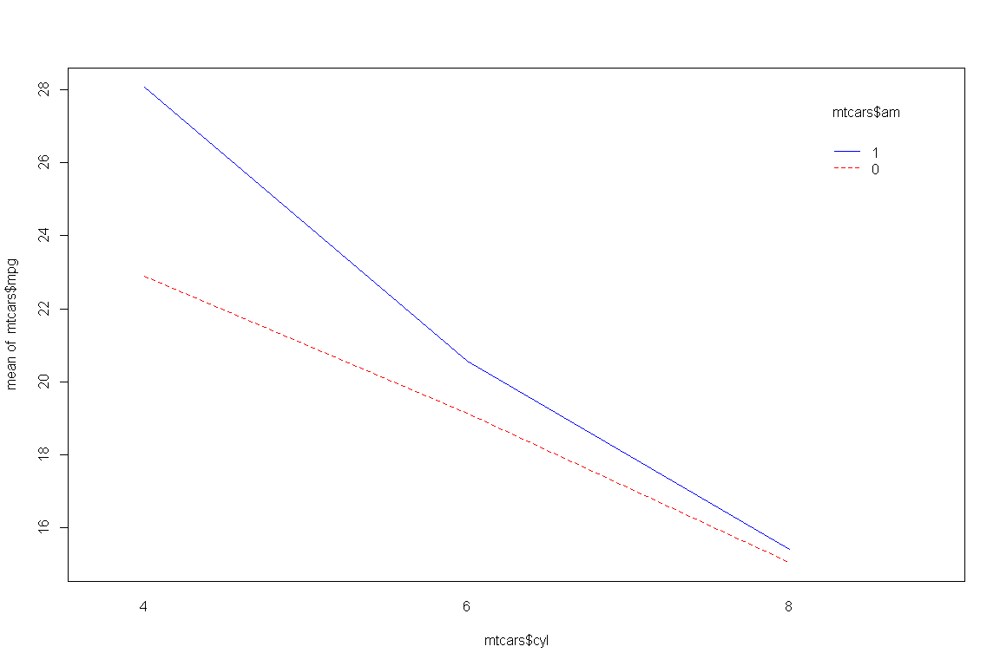

교차분석
================

# Prerequisite

``` r
rm(list=ls())
# getwd()
# setwd("./R") # if necessary

viewSamples <- function(x,n) {
  x[sort(sample(1:nrow(x), n)),]
}
```

# 분산분석

`분산분석`은 두 개 이상의 다수 집단 간 평균을 비교하는 통계분석 방법이다.

## 일원배치 분산분석 (One-way ANOVA)

``` r
# iris 종별 꽃받침 넓이 평균에 차이가 있는지
iris.aov <- aov(Sepal.Width ~ Species, data = iris)
summary(iris.aov)
```

    ##              Df Sum Sq Mean Sq F value Pr(>F)    
    ## Species       2  11.35   5.672   49.16 <2e-16 ***
    ## Residuals   147  16.96   0.115                   
    ## ---
    ## Signif. codes:  0 '***' 0.001 '**' 0.01 '*' 0.05 '.' 0.1 ' ' 1

Pr(\>F)\<2e-16으로 유의수준 0.05 하에서 귀무가설을 기각한다. 따라서 종 중 어느 하나 이상은 평균이 동일하지
않다고 판단할 수 있다.

``` r
# 사후검정
TukeyHSD(iris.aov)
```

    ##   Tukey multiple comparisons of means
    ##     95% family-wise confidence level
    ## 
    ## Fit: aov(formula = Sepal.Width ~ Species, data = iris)
    ## 
    ## $Species
    ##                        diff         lwr        upr     p adj
    ## versicolor-setosa    -0.658 -0.81885528 -0.4971447 0.0000000
    ## virginica-setosa     -0.454 -0.61485528 -0.2931447 0.0000000
    ## virginica-versicolor  0.204  0.04314472  0.3648553 0.0087802

p adj 값이 모두 유의수준 0.05 이하이며, versicolor-setosa 간의 평균차가 가장 크다.

## 이원배치 분산분석 (Two-way ANOVA)

``` r
# 변속기 종류와 실린더 개수에 따른 주행거리 평균 차
data("mtcars")
mtcars$cyl <- as.factor(mtcars$cyl)
mtcars$am <- as.factor(mtcars$am)
mtcars.aov <- aov(mpg ~ cyl*am, mtcars)
summary(mtcars.aov)
```

    ##             Df Sum Sq Mean Sq F value   Pr(>F)    
    ## cyl          2  824.8   412.4  44.852 3.73e-09 ***
    ## am           1   36.8    36.8   3.999   0.0561 .  
    ## cyl:am       2   25.4    12.7   1.383   0.2686    
    ## Residuals   26  239.1     9.2                     
    ## ---
    ## Signif. codes:  0 '***' 0.001 '**' 0.01 '*' 0.05 '.' 0.1 ' ' 1

유의수준 0.05 이하에서 cyl는 귀무가설을 기각하고, am은 귀무가설을 채택한다. 따라서 실린더 개수에 다라 주행거리 간
통계적으로 유의미한 차이가 있고, 변속기에 따라 주행거리간 통계적 유의한 차이는 없다고 판단할 수 있다. 그리고
실린더와 변속기의 교호작용은 Pr(\>F) 0.2686으로 귀무가설(교호작용이 없다)을 채택한다.

``` r
# 교호작용 여부를 그래프로 확인
interaction.plot(mtcars$cyl, mtcars$am, mtcars$mpg, col = c("red", "blue"))
```

<!-- -->

-----

EOD
