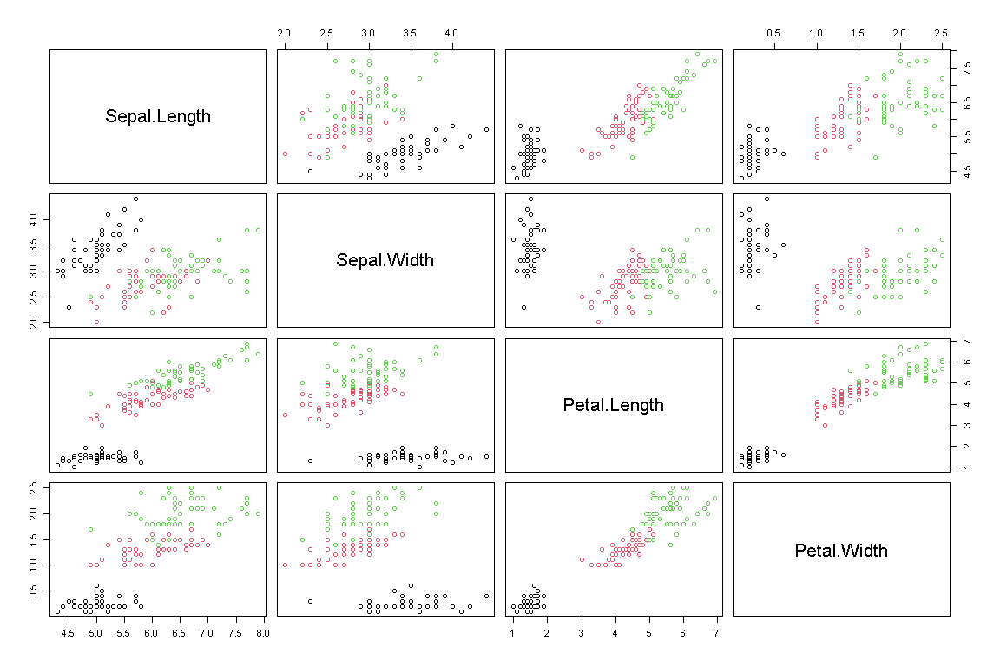
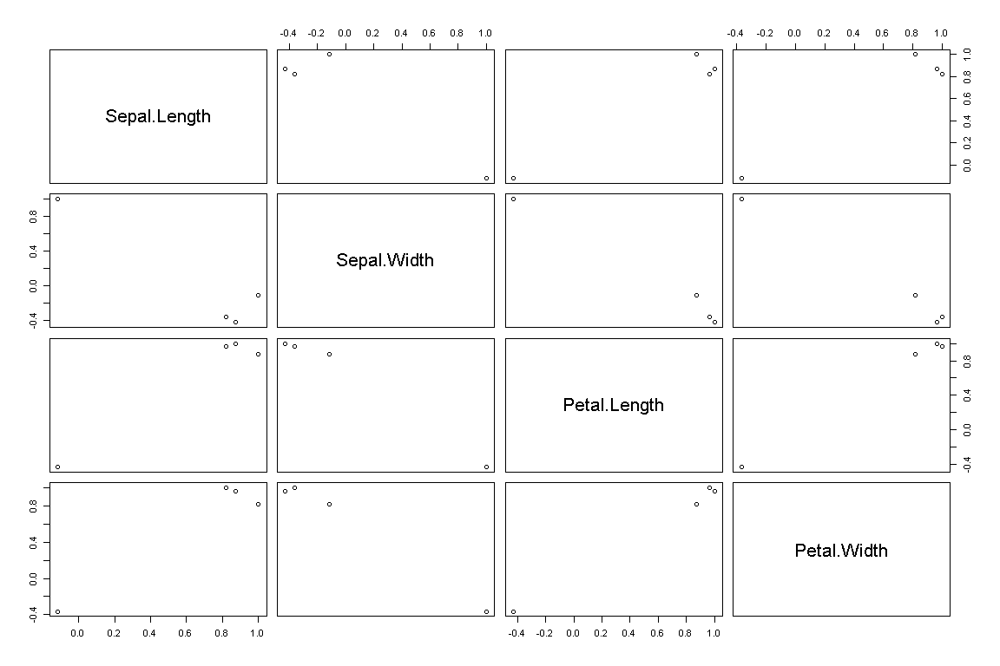
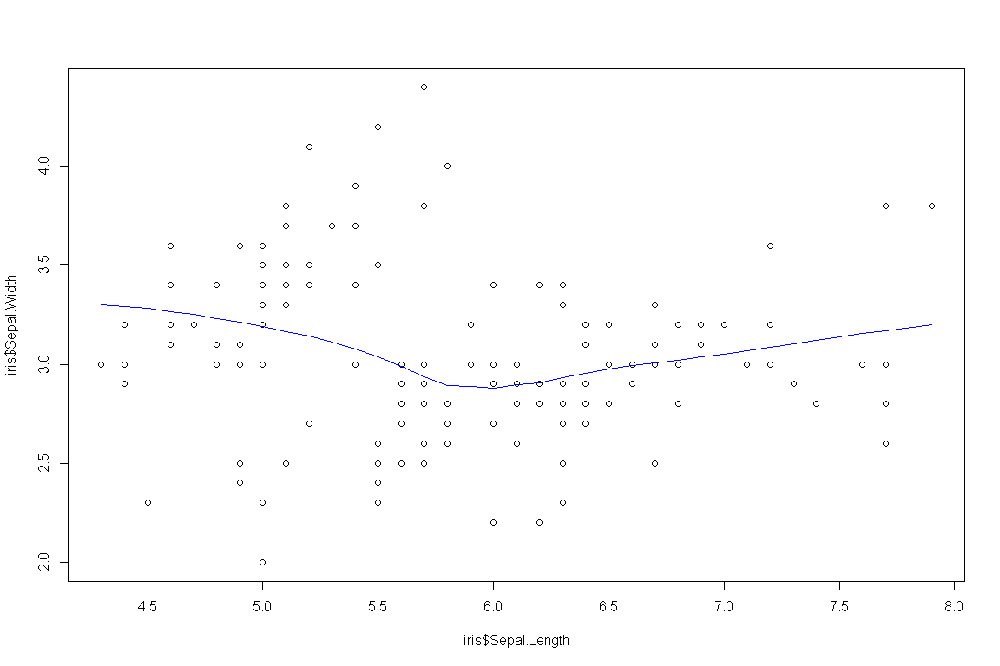
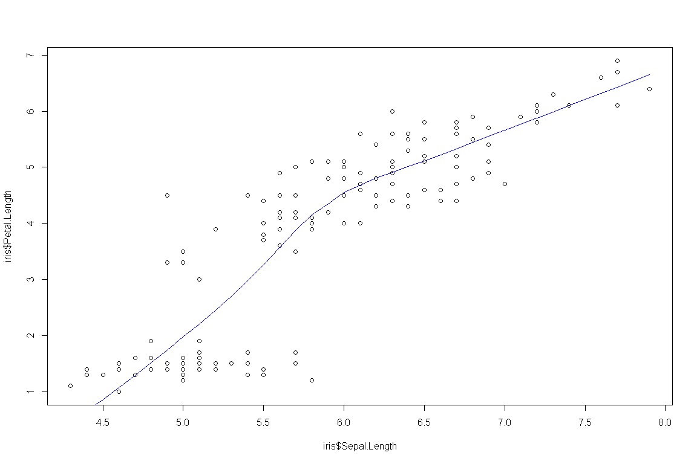

상관분석
================

# Prerequisite

``` r
rm(list=ls())
# getwd()
# setwd("./R") # if necessary

viewSamples <- function(x,n) {
  x[sort(sample(1:nrow(x), n)),]
}
```

# 상관분석

`상관분석`이란 두 변수간 관계의 정도를 알아보기 위한 분석방법이다.

\[r=\frac{cov(x,y)}{S_x * S_y}\]

``` r
data(iris)

iris.cor <- cor(iris[,-5], use = "pairwise.complete.obs", method = "pearson")
iris.cor
```

    ##              Sepal.Length Sepal.Width Petal.Length Petal.Width
    ## Sepal.Length    1.0000000  -0.1175698    0.8717538   0.8179411
    ## Sepal.Width    -0.1175698   1.0000000   -0.4284401  -0.3661259
    ## Petal.Length    0.8717538  -0.4284401    1.0000000   0.9628654
    ## Petal.Width     0.8179411  -0.3661259    0.9628654   1.0000000

``` r
cor(iris[,-5], use = "pairwise.complete.obs", method = "spearman")
```

    ##              Sepal.Length Sepal.Width Petal.Length Petal.Width
    ## Sepal.Length    1.0000000  -0.1667777    0.8818981   0.8342888
    ## Sepal.Width    -0.1667777   1.0000000   -0.3096351  -0.2890317
    ## Petal.Length    0.8818981  -0.3096351    1.0000000   0.9376668
    ## Petal.Width     0.8342888  -0.2890317    0.9376668   1.0000000

``` r
cor(iris[,-5], use = "pairwise.complete.obs", method = "kendall")
```

    ##              Sepal.Length Sepal.Width Petal.Length Petal.Width
    ## Sepal.Length   1.00000000 -0.07699679    0.7185159   0.6553086
    ## Sepal.Width   -0.07699679  1.00000000   -0.1859944  -0.1571257
    ## Petal.Length   0.71851593 -0.18599442    1.0000000   0.8068907
    ## Petal.Width    0.65530856 -0.15712566    0.8068907   1.0000000

``` r
pairs(iris[,-5], col = iris$Species)
```

<!-- -->

``` r
pairs(iris.cor)
```

<!-- -->

``` r
# 꽃받침의 길이과 넓이의 상관관계
cor.test(iris$Sepal.Length, iris$Sepal.Width, method = "pearson")
```

    ## 
    ##  Pearson's product-moment correlation
    ## 
    ## data:  iris$Sepal.Length and iris$Sepal.Width
    ## t = -1.4403, df = 148, p-value = 0.1519
    ## alternative hypothesis: true correlation is not equal to 0
    ## 95 percent confidence interval:
    ##  -0.27269325  0.04351158
    ## sample estimates:
    ##        cor 
    ## -0.1175698

p-value = 0.1519로 유의수준 0.05 이하에서 귀무가설을 채택한다. 따라서 상관계수는 0으로 꽃받침의 폭과 넓이는
관계가 없다고 판단할 수 있다.

``` r
plot(iris$Sepal.Length, iris$Sepal.Width)
lines(lowess(iris$Sepal.Length, iris$Sepal.Width), col="blue")
```

<!-- -->

``` r
# 꽃받침의 길이과 꽃잎의 길이 상관관계
cor.test(iris$Sepal.Length, iris$Petal.Length, method = "pearson")
```

    ## 
    ##  Pearson's product-moment correlation
    ## 
    ## data:  iris$Sepal.Length and iris$Petal.Length
    ## t = 21.646, df = 148, p-value < 2.2e-16
    ## alternative hypothesis: true correlation is not equal to 0
    ## 95 percent confidence interval:
    ##  0.8270363 0.9055080
    ## sample estimates:
    ##       cor 
    ## 0.8717538

p-value \< 2.2e-16로 유의수준 0.05 이하에서 귀무가설을 기각한다. 따라서 꽃받침의 길이와 꽃잎의 길이는
상관관계가 있다고 판단할 수 있다. 계산된 상관계수는 0.8717538로 강한 양의 상관관계가 있다고 해석할 수
있다.

``` r
plot(iris$Sepal.Length, iris$Petal.Length)
lines(lowess(iris$Sepal.Length, iris$Petal.Length), col="blue")
```

<!-- -->

-----

EOD
