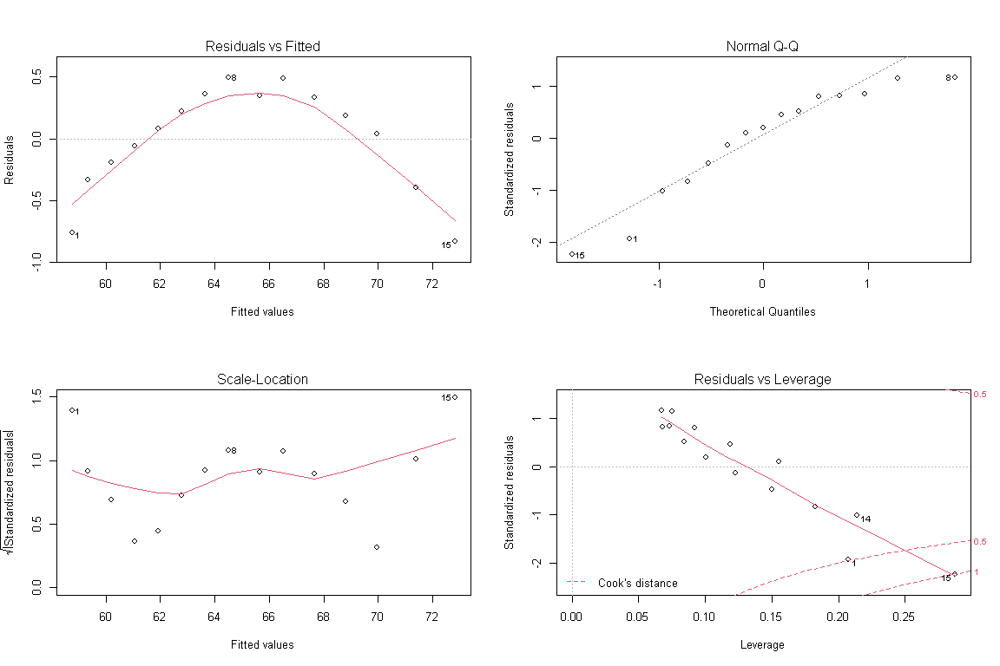

상관분석
================

# Prerequisite

``` r
rm(list=ls())
# getwd()
# setwd("./R") # if necessary

viewSamples <- function(x,n) {
  x[sort(sample(1:nrow(x), n)),]
}
```

# 회귀분석

`회귀분석`이란 하나 혹은 그 이상의 원인(독립변수)이 결과(종속변수)에 미치는 영향을 추정하여 식으로 표현할 수 있는
통계기법이다.

\[ **선형회귀분석의 가정** \]

  - 독립변수와 종속변수 간의 선형성
  - 오차의 등분산성
  - 오차의 독립성
  - 오차의 정규성

## 단순선형회귀분석

\[ **회귀분석 시 검토사항** \]

  - 모형 내의 회귀계수는 유의한가?
  - 모형은 데이터를 얼마나 설명할 수 있는가?
  - 회귀모형은 통계적으로 유의한가?
  - 모형이 데이터를 잘 적합하고 있는가?

<!-- end list -->

``` r
data(women)
women.lm <- lm(height ~ weight, women)
summary(women.lm)
```

    ## 
    ## Call:
    ## lm(formula = height ~ weight, data = women)
    ## 
    ## Residuals:
    ##      Min       1Q   Median       3Q      Max 
    ## -0.83233 -0.26249  0.08314  0.34353  0.49790 
    ## 
    ## Coefficients:
    ##              Estimate Std. Error t value Pr(>|t|)    
    ## (Intercept) 25.723456   1.043746   24.64 2.68e-12 ***
    ## weight       0.287249   0.007588   37.85 1.09e-14 ***
    ## ---
    ## Signif. codes:  0 '***' 0.001 '**' 0.01 '*' 0.05 '.' 0.1 ' ' 1
    ## 
    ## Residual standard error: 0.44 on 13 degrees of freedom
    ## Multiple R-squared:  0.991,  Adjusted R-squared:  0.9903 
    ## F-statistic:  1433 on 1 and 13 DF,  p-value: 1.091e-14

``` r
par(mfrow = c(2,2))
plot(women.lm)
```

<!-- -->

``` r
idx <- sample(1:nrow(women), nrow(women)*0.7, replace = T)
women.pred <- predict.lm(women.lm, women[-idx, ], interval = "none")
rbind(women.pred, women[-idx,c("height")])
```

    ##                   1        2        3        4        5        7       8       13       14
    ## women.pred 58.75712 59.33162 60.19336 61.05511 61.91686 63.64035 64.5021 69.95984 71.39608
    ##            58.00000 59.00000 60.00000 61.00000 62.00000 64.00000 65.0000 70.00000 71.00000

## 다중선형회귀분석

``` r
data(iris)
iris.lm <- lm(Sepal.Length ~ ., iris)
summary(iris.lm)
```

    ## 
    ## Call:
    ## lm(formula = Sepal.Length ~ ., data = iris)
    ## 
    ## Residuals:
    ##      Min       1Q   Median       3Q      Max 
    ## -0.79424 -0.21874  0.00899  0.20255  0.73103 
    ## 
    ## Coefficients:
    ##                   Estimate Std. Error t value Pr(>|t|)    
    ## (Intercept)        2.17127    0.27979   7.760 1.43e-12 ***
    ## Sepal.Width        0.49589    0.08607   5.761 4.87e-08 ***
    ## Petal.Length       0.82924    0.06853  12.101  < 2e-16 ***
    ## Petal.Width       -0.31516    0.15120  -2.084  0.03889 *  
    ## Speciesversicolor -0.72356    0.24017  -3.013  0.00306 ** 
    ## Speciesvirginica  -1.02350    0.33373  -3.067  0.00258 ** 
    ## ---
    ## Signif. codes:  0 '***' 0.001 '**' 0.01 '*' 0.05 '.' 0.1 ' ' 1
    ## 
    ## Residual standard error: 0.3068 on 144 degrees of freedom
    ## Multiple R-squared:  0.8673, Adjusted R-squared:  0.8627 
    ## F-statistic: 188.3 on 5 and 144 DF,  p-value: < 2.2e-16

범주형 데이터인 경우 더미변수화가 수행된 것을 확인할 수 있다.

``` r
iris.lm <- lm(Sepal.Length ~ Sepal.Width + Petal.Length + Petal.Width, iris)
summary(iris.lm)
```

    ## 
    ## Call:
    ## lm(formula = Sepal.Length ~ Sepal.Width + Petal.Length + Petal.Width, 
    ##     data = iris)
    ## 
    ## Residuals:
    ##      Min       1Q   Median       3Q      Max 
    ## -0.82816 -0.21989  0.01875  0.19709  0.84570 
    ## 
    ## Coefficients:
    ##              Estimate Std. Error t value Pr(>|t|)    
    ## (Intercept)   1.85600    0.25078   7.401 9.85e-12 ***
    ## Sepal.Width   0.65084    0.06665   9.765  < 2e-16 ***
    ## Petal.Length  0.70913    0.05672  12.502  < 2e-16 ***
    ## Petal.Width  -0.55648    0.12755  -4.363 2.41e-05 ***
    ## ---
    ## Signif. codes:  0 '***' 0.001 '**' 0.01 '*' 0.05 '.' 0.1 ' ' 1
    ## 
    ## Residual standard error: 0.3145 on 146 degrees of freedom
    ## Multiple R-squared:  0.8586, Adjusted R-squared:  0.8557 
    ## F-statistic: 295.5 on 3 and 146 DF,  p-value: < 2.2e-16

``` r
# 변수 선택법
library(MASS)
Cars93.lm <- lm(Price ~ EngineSize + RPM  + Length + Width + Weight, Cars93)
summary(Cars93.lm)
```

    ## 
    ## Call:
    ## lm(formula = Price ~ EngineSize + RPM + Length + Width + Weight, 
    ##     data = Cars93)
    ## 
    ## Residuals:
    ##    Min     1Q Median     3Q    Max 
    ## -9.981 -3.957 -0.976  3.008 31.709 
    ## 
    ## Coefficients:
    ##              Estimate Std. Error t value Pr(>|t|)    
    ## (Intercept) 34.428574  26.349906   1.307 0.194795    
    ## EngineSize   6.197088   1.381533   4.486 2.21e-05 ***
    ## RPM          0.005991   0.001322   4.532 1.86e-05 ***
    ## Length       0.041518   0.081907   0.507 0.613513    
    ## Width       -1.541273   0.433237  -3.558 0.000609 ***
    ## Weight       0.011792   0.002524   4.672 1.08e-05 ***
    ## ---
    ## Signif. codes:  0 '***' 0.001 '**' 0.01 '*' 0.05 '.' 0.1 ' ' 1
    ## 
    ## Residual standard error: 6.136 on 87 degrees of freedom
    ## Multiple R-squared:  0.6184, Adjusted R-squared:  0.5965 
    ## F-statistic:  28.2 on 5 and 87 DF,  p-value: < 2.2e-16

``` r
step(Cars93.lm, direction = "backward")
```

    ## Start:  AIC=343.22
    ## Price ~ EngineSize + RPM + Length + Width + Weight
    ## 
    ##              Df Sum of Sq    RSS    AIC
    ## - Length      1      9.67 3284.9 341.50
    ## <none>                    3275.3 343.22
    ## - Width       1    476.47 3751.7 353.86
    ## - EngineSize  1    757.50 4032.8 360.57
    ## - RPM         1    773.09 4048.4 360.93
    ## - Weight      1    821.64 4096.9 362.04
    ## 
    ## Step:  AIC=341.5
    ## Price ~ EngineSize + RPM + Width + Weight
    ## 
    ##              Df Sum of Sq    RSS    AIC
    ## <none>                    3284.9 341.50
    ## - Width       1    479.70 3764.6 352.18
    ## - RPM         1    773.81 4058.8 359.17
    ## - EngineSize  1    796.25 4081.2 359.68
    ## - Weight      1    923.71 4208.6 362.54

    ## 
    ## Call:
    ## lm(formula = Price ~ EngineSize + RPM + Width + Weight, data = Cars93)
    ## 
    ## Coefficients:
    ## (Intercept)   EngineSize          RPM        Width       Weight  
    ##   36.223202     6.293338     0.005994    -1.475507     0.012110

변수선택법 수행 전후 수식

  - 전: formula = Price \~ EngineSize + RPM + Length + Width + Weight
  - 후: formula = Price \~ EngineSize + RPM + Width + Weight

-----

EOD
